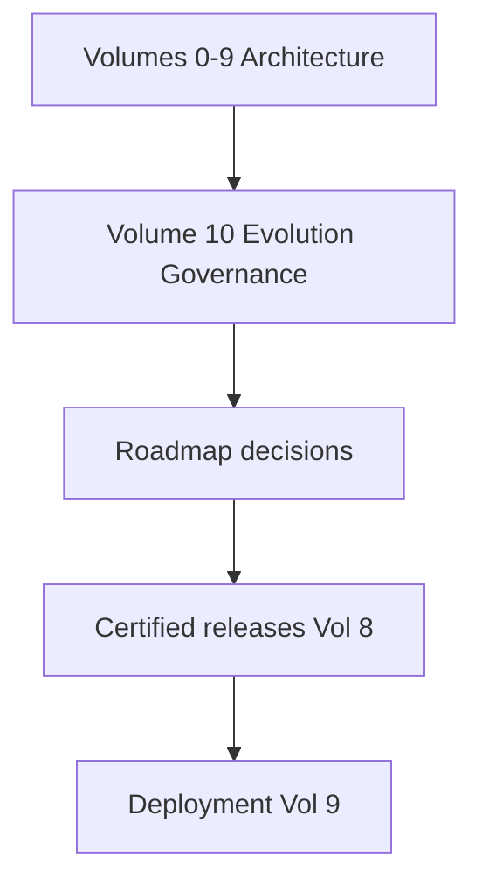
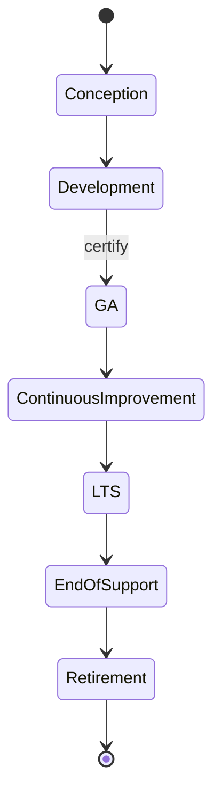
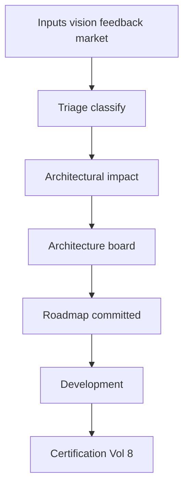
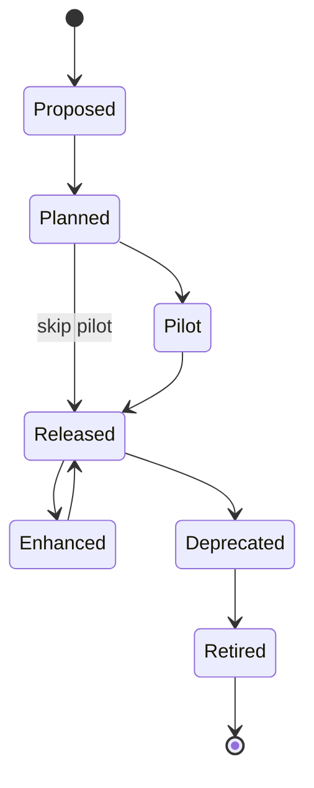
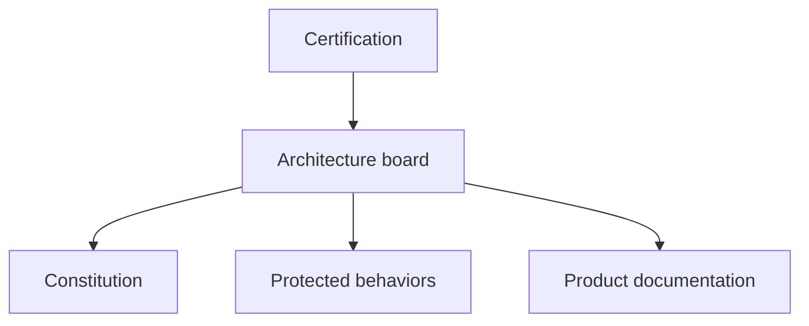
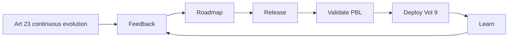

# Product Lifecycle, Roadmap & Continuous Evolution

| Field | Value |
|-------|-------|
| **Document ID** | FT-PD-100 |
| **Volume** | 10 — Product Lifecycle & Continuous Evolution |
| **Chapter** | 1 — Product Lifecycle, Roadmap & Continuous Evolution |
| **Title** | Product Lifecycle, Roadmap & Continuous Evolution |
| **Version** | 1.0.0 |
| **Status** | Draft — Architecture Review |
| **Effective date** | 2026-05-29 |
| **Author** | FT ERP Product Team |
| **Owner** | FT ERP Product Architecture |
| **Audience** | Product owners, roadmap stewards, architecture board, implementation partners, customer executives |
| **Classification** | Product — Evolution & Stewardship Architecture |

**Parent documents:**

- [Volume 0 — Product Vision & Strategy](../00_Product_Vision_and_Strategy/README.md)
- [Volume 1, Ch. 2 — FT ERP Constitution](../01_Product_Foundation/Chapter_02_FT_ERP_Constitution.md)
- [Volume 8 — Product Testing & Validation](../08_Product_Testing_and_Validation/README.md)
- [Volume 9 — Deployment & Operations Architecture](../09_Deployment_and_Operations_Architecture/README.md)

---

## 1. Document Control

| Version | Date | Author | Summary |
|---------|------|--------|---------|
| 1.0.0 | 2026-05-29 | FT ERP Product Team | Initial Product Lifecycle, Roadmap & Continuous Evolution |

**Supersedes:** None.

**Change authority:** Product Owner + Product Architecture Board. Evolution policy changes require Constitution compliance review.

**Out of scope:** Sprint planning, agile ceremonies, project management tools, issue trackers, source code, vendor-specific processes.

---

## 2. Purpose

This chapter defines **governance architecture** ensuring FT ERP **evolves predictably** while preserving the **FT ERP Constitution**, **protected behaviors**, **workflow integrity**, and **long-term business value**.

It specifies:

- **Product lifecycle** and **roadmap governance**
- **Innovation** and **feature lifecycle**
- **Architectural stewardship** and **product maturity**

The objective is to ensure every future enhancement **strengthens FT ERP** without compromising architectural foundations.

---

## 3. Scope

### 3.1 In scope

- Product evolution philosophy (§5)
- Product lifecycle model (§6)
- Roadmap and innovation governance (§7–8)
- Feature lifecycle (§9)
- Architectural stewardship (§10)
- Evolution matrices (§12, §12A–F)
- Business Rules EVO-01–EVO-12 (§11)
- Diagrams (§13)

### 3.2 Out of scope

- ADR format and change control detail — see [Volume 10 Ch. 2 (FT-PD-101)](./Chapter_02_Feature_Governance_Change_Control_and_Architectural_Decision_Records.md)
- Manufacturing domain depth (Volume 11 Manufacturing Knowledge planned)
- Customer project plans and SOWs

### 3.3 Concept distinctions

| Concept | Definition |
|---------|------------|
| **Product evolution** | Governed enhancement of Core Product over releases |
| **Customer implementation** | Tenant deploy, config, migration — Volume 9 |
| **Product maintenance** | Supported-release patches and corrections |
| **Product enhancement** | New capability within architecture bounds |
| **Product innovation** | Experimental or pilot capability before GA |

---

## 4. Relationship with Previous Volumes

Product evolution **consumes** the complete architecture defined in Volumes 0–9 — it does **not** replace it.

| Volume | Evolution relationship |
|--------|------------------------|
| **0** | Vision and positioning — roadmap north star |
| **1** | Constitution — non-negotiable evolution boundary |
| **2–3** | Domain and pipeline semantics — enhancement scope |
| **4** | Workflow Engine — state/guard changes require formal amendment |
| **5** | Data immutability — evolution preserves historical rules |
| **6** | UI surface triad — enhancements respect Dashboard/Workspace/CT |
| **7** | Security, config, integration overlays |
| **8** | PBL, certification, validation before release |
| **9** | DEP/INS/OPS/RES/LCM — operational placement of evolved product |

---

## 5. Product Evolution Philosophy

| Principle | Definition |
|-----------|------------|
| **Constitution-first evolution** | Art. 1–23 constrain all proposals ([EVO-01](#11-business-rules)) |
| **Architecture preservation** | PBL and cross-volume consistency maintained |
| **Customer-driven innovation** | Feedback informs — does not fork Core |
| **Controlled experimentation** | Pilot features gated — not production by default |
| **Backward compatibility** | Closed history and cert evidence remain valid |
| **Sustainable growth** | LCM stewardship scales with maturity |
| **Evidence-based roadmap decisions** | Impact assessment before commitment |

---

## 6. Product Lifecycle Model

| Stage | Objective | Governance |
|-------|-----------|------------|
| **Product conception** | Vision-aligned capability defined | Volume 0 alignment; Constitution check |
| **Active development** | Architecture-compliant build | Vol. 4–7 design; Vol. 8 validation |
| **General availability** | Certified release available | REL certification; DEP deployment |
| **Continuous improvement** | Patches and minor enhancements | PBL regression; scoped cert |
| **Long-term support** | Security and critical fixes on supported versions | LCM-04 supported release policy |
| **End-of-support** | No new production deploy on version | Migration path documented |
| **Retirement** | Version archived; evidence retained | EVD historical records |

---

## 7. Product Roadmap Governance

| Element | Governance |
|---------|------------|
| **Vision alignment** | Every initiative maps to Volume 0 themes |
| **Strategic initiatives** | Architecture board prioritization |
| **Customer feedback** | Classified: defect, config, enhancement, out-of-scope |
| **Market analysis** | Informs — does not override Constitution |
| **Feature prioritization** | Constitution + PBL + capacity to certify |
| **Architectural impact assessment** | Required for every roadmap item ([EVO-03](#11-business-rules)) |
| **Release planning** | Major/minor/patch per FT-PD-090; Vol. 8 gates |

---

## 8. Innovation Governance

| Element | Governance |
|---------|------------|
| **New feature proposals** | Written proposal + architecture impact |
| **Experimental capabilities** | Feature flag; default off ([CFG-09](../07_Security_and_Governance_Architecture/Chapter_04_Configuration_Business_Policies_and_Feature_Flag_Architecture.md)) |
| **Proof of concepts** | Non-production; no customer production dependency |
| **Pilot features** | Selected tenants; time-bound; enhanced audit |
| **General availability** | Full certification path |
| **Innovation review** | Architecture board + Product Owner |
| **Architectural review** | Cross-volume consistency check |

**Rule:** **Innovation never bypasses governance** — pilot ≠ skip PBL ([EVO-05](#11-business-rules)).

---

## 9. Feature Lifecycle Governance

| State | Entry | Approval |
|-------|-------|----------|
| **Proposed** | Idea documented | Product triage |
| **Planned** | Roadmap slot; impact assessed | Architecture board |
| **Pilot** | Experimental flag; limited scope | Product Owner + pilot sponsor |
| **Released** | GA in certified build | Full Vol. 8 certification |
| **Enhanced** | Revision within architecture | Scoped regression |
| **Deprecated** | Successor or removal announced | Product Owner; migration guide |
| **Retired** | Removed from product | End-of-support comms; EVD archive |

---

## 10. Architectural Stewardship

| Area | Stewardship |
|------|-------------|
| **Constitution compliance** | Every release attestation |
| **Protected behavior preservation** | PBL catalog maintained — no silent regression |
| **Workflow consistency** | Vol. 4 authority for semantic changes |
| **Cross-volume consistency** | Doc version alignment on release |
| **Documentation evolution** | Product docs version with release |
| **Technical debt governance** | Tracked; paydown in roadmap — not bypass Guards |
| **Long-term ownership** | Product Architecture Board |

---

## 11. Business Rules

| ID | Rule |
|----|------|
| **EVO-01** | **Product evolution shall preserve the Constitution** — Art. 1–23. |
| **EVO-02** | **Protected behaviors cannot regress** — PBL enforced ([PBL-07](../08_Product_Testing_and_Validation/Chapter_02_Workflow_Regression_Guardrails_and_Protected_Behavior_Catalog.md)). |
| **EVO-03** | **Every roadmap decision requires architectural assessment** — documented impact. |
| **EVO-04** | **Deprecated features require migration guidance** before retirement. |
| **EVO-05** | **Innovation never bypasses governance** — pilot uses flags and audit. |
| **EVO-06** | **Product vision remains traceable across releases** — roadmap linked to Volume 0. |
| **EVO-07** | **Core Product shall not be forked** for single customer ([Art. 16](../01_Product_Foundation/Chapter_02_FT_ERP_Constitution.md)). |
| **EVO-08** | **Workflow semantic changes require Volume 4 amendment** — not roadmap alone. |
| **EVO-09** | **Every GA feature requires certification evidence** — Vol. 8 gates. |
| **EVO-10** | **Documentation versions align with certified releases** ([LCM-05](../09_Deployment_and_Operations_Architecture/Chapter_05_Operational_Governance_Capacity_Planning_and_Lifecycle_Management.md)). |
| **EVO-11** | **Continuous evolution revalidates on major release** — Art. 23 ([Constitution](../01_Product_Foundation/Chapter_02_FT_ERP_Constitution.md)). |
| **EVO-12** | **Retired features retain historical documentation** — EVD archive. |

---

## 12. Evolution Matrices

### 12A. Product Lifecycle Matrix

| Lifecycle Stage | Objective | Governance | Exit Criteria |
|-----------------|-----------|------------|---------------|
| **Conception** | Valid opportunity | Vision + Constitution screen | Approved proposal |
| **Active development** | Build compliant product | Vol. 2–7 design standards | Validation ready |
| **General availability** | Customer deployable | Vol. 8 certification | REL record issued |
| **Continuous improvement** | Sustained value | Patch/minor cert | Supported version current |
| **Long-term support** | Maintain supported installs | LTS policy | Successor GA available |
| **End-of-support** | Orderly migration | Customer comms | Zero production on EOS version |
| **Retirement** | Archive | EVD retention | Historical access only |

### 12B. Roadmap Governance Matrix

| Roadmap Input | Evaluation | Approval | Release Path |
|---------------|------------|----------|--------------|
| **Vision initiative** | Strategic fit | Product Owner | Major release |
| **Customer feedback** | Classify + impact | Architecture board | Minor/patch per impact |
| **Market analysis** | Constitution fit | Product Owner | Roadmap slot |
| **Defect / PBL gap** | Root cause | Workflow lead | Patch cert |
| **Compliance / security** | SEC/GOV impact | Security + Compliance | Patch or minor |
| **Technical debt** | PBL risk | Architecture board | Scheduled minor |

### 12C. Innovation Matrix

| Innovation Stage | Review | Validation | Approval |
|------------------|--------|------------|----------|
| **Proposal** | Architecture triage | Constitution screen | Product triage |
| **PoC** | Technical feasibility | Non-prod only | Architecture delegate |
| **Pilot** | PBL spot in pilot | Pilot tenant evidence | Product Owner |
| **GA promotion** | Full impact assessment | Vol. 8 full gates | Product Owner + cert |
| **Reject / defer** | Document reason | N/A | Architecture board |

### 12D. Feature Lifecycle Matrix

| Feature State | Entry Criteria | Exit Criteria | Owner |
|---------------|----------------|---------------|-------|
| **Proposed** | Documented need | Triage decision | Product management |
| **Planned** | Roadmap slot + impact doc | Dev complete or defer | Product Owner |
| **Pilot** | Flag + pilot plan | GA decision or retire | Product Owner |
| **Released** | Certified build | Deprecation notice | Product Owner |
| **Enhanced** | Scoped change | Re-cert evidence | Domain lead |
| **Deprecated** | Successor identified | Retirement date set | Product Owner |
| **Retired** | EOS reached | Doc archived | Compliance |

### 12E. Architectural Stewardship Matrix

| Architecture Area | Stewardship Responsibility | Review Frequency | Evidence |
|-------------------|---------------------------|------------------|----------|
| **Constitution** | Product Architecture Board | Per major release | Article checklist |
| **Workflow (Vol. 4)** | Workflow Engineering Lead | Per workflow change | Guard Registry diff |
| **Data (Vol. 5)** | Data Architecture Lead | Per persistence change | WES rule review |
| **UI (Vol. 6)** | UX + Product | Per surface change | UXA scenario |
| **Governance (Vol. 7)** | Security + Compliance | Quarterly + per change | SEC/GOV sample |
| **Validation (Vol. 8)** | Validation Lead | Per release | Cert bundle |
| **Operations (Vol. 9)** | Operations Governance | Per major release | LCM review |

### 12F. Product Maturity Matrix

| Maturity Level | Characteristics | Governance Focus | Evolution Strategy |
|----------------|-----------------|------------------|-------------------|
| **Pilot Product** | First customers; limited domains | Certification + hypercare | Stabilize core pipelines |
| **Early Adoption** | Growing customer base | PBL + minor releases | Expand domain depth |
| **Production Proven** | Reference deployments | LTS + continuous compliance | Performance and UX polish |
| **Enterprise Scale** | Multi-site customers | LCM + integration depth | Optional modules |
| **Mature Platform** | Broad adoption; long history | EOS policy + archive | Innovation within Constitution |

---

## 13. Logical Diagrams

### 13.1 Product lifecycle

### 13.2 Roadmap governance

### 13.3 Innovation pipeline

### 13.4 Feature lifecycle

### 13.5 Architecture stewardship

### 13.6 Continuous evolution

---

## 14. Review Checklist

- [ ] Lifecycle completeness — §6, §12A
- [ ] Roadmap governance — §7, §12B, EVO-03
- [ ] Innovation governance — §8, §12C, EVO-05
- [ ] Feature lifecycle — §9, §12D
- [ ] Constitution alignment — EVO-01, EVO-07
- [ ] Protected behavior preservation — EVO-02
- [ ] Cross-volume consistency — §12E
- [ ] Product maturity — §12F
- [ ] Six Mermaid diagrams
- [ ] No sprint/agile/tooling detail

---

## 15. Change Log

| Version | Date | Author | Summary |
|---------|------|--------|---------|
| 1.0.0 | 2026-05-29 | FT ERP Product Team | Initial Product Lifecycle, Roadmap & Continuous Evolution |

---

## 16. Approval Block

| Role | Name | Signature | Date |
|------|------|-----------|------|
| Product Owner | | | |
| Product Architecture Board Chair | | | |
| Validation / QA Lead | | | |
| Compliance Officer | | | |
| Customer Advisory Representative | | | |

---

## Writing Requirements

Remain **technology-neutral**.

**Do not include:** Sprint planning, agile ceremonies, project management tools, issue trackers, source code, vendor-specific processes.

**Describe product governance architecture only.**

---

## Document navigation

| | Link |
|--|------|
| **Previous** | [Operational Governance, Capacity Planning & Lifecycle Management](../09_Deployment_and_Operations_Architecture/Chapter_05_Operational_Governance_Capacity_Planning_and_Lifecycle_Management.md) (FT-PD-094) |
| **Next** | [Feature Governance, Change Control & Architectural Decision Records](./Chapter_02_Feature_Governance_Change_Control_and_Architectural_Decision_Records.md) (FT-PD-101) |
| **Volume** | [Product Lifecycle and Continuous Evolution](./README.md) |
| **Product** | [Product Documentation Index](../README.md) |

