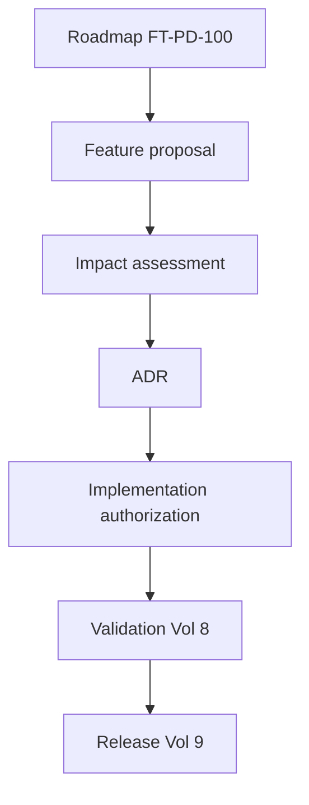
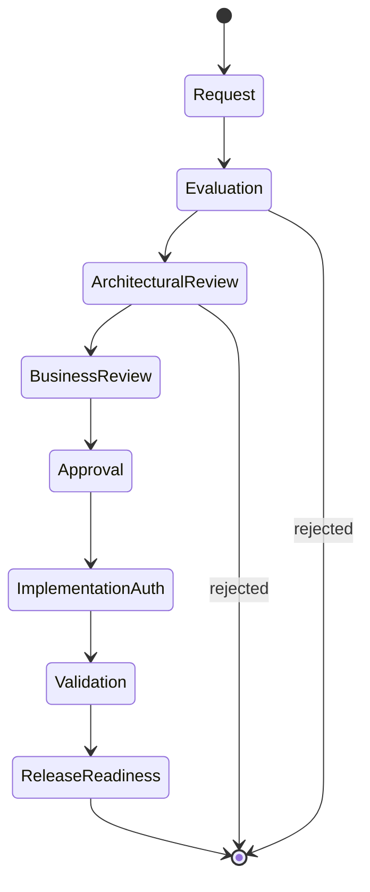
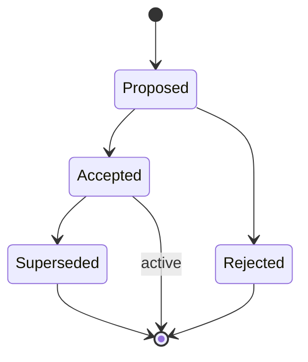
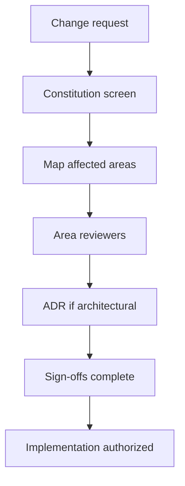
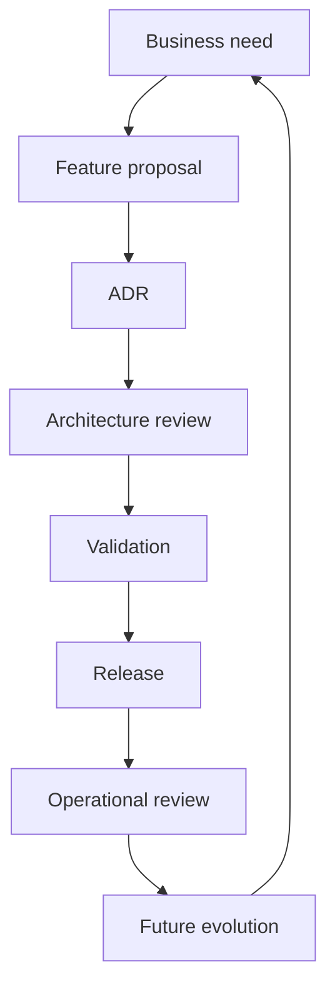
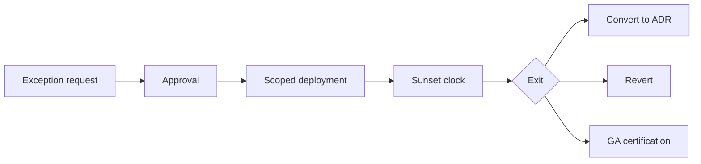
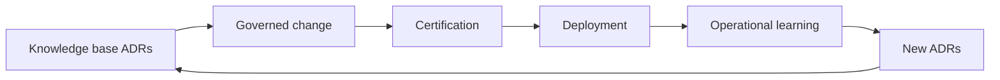

# Feature Governance, Change Control & Architectural Decision Records

| Field | Value |
|-------|-------|
| **Document ID** | FT-PD-101 |
| **Volume** | 10 — Product Lifecycle & Continuous Evolution |
| **Chapter** | 2 — Feature Governance, Change Control & Architectural Decision Records |
| **Title** | Feature Governance, Change Control & Architectural Decision Records |
| **Version** | 1.0.0 |
| **Status** | Draft — Architecture Review |
| **Effective date** | 2026-05-29 |
| **Author** | FT ERP Product Team |
| **Owner** | FT ERP Product Architecture |
| **Audience** | Product owners, architecture board, domain leads, validation leads, implementation partners, compliance officers |
| **Classification** | Product — Governance & Decision Architecture |

**Parent documents:**

- [Volume 1, Ch. 2 — FT ERP Constitution](../01_Product_Foundation/Chapter_02_FT_ERP_Constitution.md)
- [Volume 8 — Product Testing & Validation](../08_Product_Testing_and_Validation/README.md)
- [Volume 10, Ch. 1 — Product Lifecycle, Roadmap & Continuous Evolution](./Chapter_01_Product_Lifecycle_Roadmap_and_Continuous_Evolution.md)

---

## 1. Document Control

| Version | Date | Author | Summary |
|---------|------|--------|---------|
| 1.0.0 | 2026-05-29 | FT ERP Product Team | Initial Feature Governance, Change Control & Architectural Decision Records |

**Supersedes:** None.

**Change authority:** Product Architecture Board. ADR policy changes require Constitution compliance review.

**Out of scope:** Git workflows, pull requests, agile ceremonies, issue trackers, source code, specific documentation tools.

---

## 2. Purpose

This chapter defines **governance architecture** ensuring every future FT ERP change remains **intentional**, **traceable**, **Constitution-compliant**, and **architecturally justified**.

It specifies:

- **Feature governance** and **change control**
- **Architectural Decision Records (ADRs)**
- **Impact analysis**, **exception handling**, and **decision traceability**
- **Long-term architectural knowledge preservation**

The objective is to ensure future product evolution remains **consistent** regardless of team size, implementation partner, or release frequency.

---

## 3. Scope

### 3.1 In scope

- Change governance philosophy (§5)
- Feature governance model (§6)
- ADR governance (§7)
- Change impact assessment (§8)
- Exception governance (§9)
- Decision traceability (§10)
- Business Rules ADR-01–ADR-12 (§11)
- Governance matrices (§12, §12A–F)
- Diagrams (§13)

### 3.2 Out of scope

- Technical debt and quality sustainability detail — see [Volume 10 Ch. 3 (FT-PD-102)](./Chapter_03_Product_Quality_Strategy_Technical_Debt_and_Architectural_Sustainability.md)
- Release packaging mechanics (Volume 9, FT-PD-090)
- Customer SOWs and project plans

### 3.3 Concept distinctions

| Concept | Definition |
|---------|------------|
| **Product roadmap** | Strategic commitment of initiatives over time — FT-PD-100 |
| **Feature proposal** | Documented request for a specific product capability |
| **Feature approval** | Authorization to implement within architecture bounds |
| **Architectural decision** | Recorded choice affecting cross-cutting product structure — ADR |
| **Change request** | Scoped modification to approved design or behavior |
| **Product release** | Certified, deployable product version — Volume 8 + 9 |

---

## 4. Relationship with Previous Volumes

Roadmap decisions ([FT-PD-100](./Chapter_01_Product_Lifecycle_Roadmap_and_Continuous_Evolution.md)) become **governed product changes** through this chapter.

| Volume | Change governance relationship |
|--------|-------------------------------|
| **0–1** | Vision and Constitution — mandatory impact assessment |
| **2–3** | Domain semantics — feature scope boundary |
| **4** | Workflow — ADR required for semantic changes |
| **5** | Data — immutability and snapshot rules assessed |
| **6** | UI — surface triad impact reviewed |
| **7** | Security, config, integration — trust boundary review |
| **8** | Validation — evidence proves approved change |
| **9** | Operations — deployability and migration assessed |
| **10 Ch. 1** | Roadmap → feature proposal entry point |



---

## 5. Change Governance Philosophy

| Principle | Definition |
|-----------|------------|
| **Constitution-first decision making** | No change proceeds without Article impact review ([ADR-02](#11-business-rules)) |
| **Evidence-based change** | Decisions supported by assessment and validation evidence |
| **Architectural accountability** | Named owners for each review area |
| **Decision transparency** | ADRs visible to all stakeholders with product access |
| **Controlled evolution** | Exceptions are time-bound — not permanent bypass |
| **Long-term maintainability** | Consequences documented for future stewards |
| **Cross-volume consistency** | Single change assessed across all affected volumes |

---

## 6. Feature Governance Model

| Stage | Objective | Governance owner |
|-------|-----------|------------------|
| **Feature request** | Need documented with business context | Product management |
| **Evaluation** | Classify: defect, enhancement, innovation, out-of-scope | Product triage |
| **Architectural review** | Cross-volume impact; ADR if architectural | Architecture board delegate |
| **Business review** | Domain fit; ownership alignment | Domain lead |
| **Approval** | Authorized scope and constraints | Product Owner |
| **Implementation authorization** | ADR accepted; impact sign-offs complete | Architecture board |
| **Validation** | PBL and certification per Vol. 8 | Validation lead |
| **Release readiness** | Certified bundle; migration notes | Product Owner + Operations |

**Responsibilities:**

- **Product Owner** — final feature approval and release readiness
- **Architecture board** — ADR acceptance and exception approval
- **Domain leads** — business review and domain documentation updates
- **Validation lead** — conformance evidence before GA

---

## 7. Architectural Decision Records (ADR)

### 7.1 Purpose

ADRs preserve **why** architectural choices were made — enabling future stewards to evolve FT ERP without rediscovering rationale or repeating rejected alternatives.

### 7.2 Logical structure

Each ADR shall contain the following elements. Structure is logical — no specific tooling or template is prescribed.

| Element | Content |
|---------|---------|
| **Decision identifier** | Unique, permanent reference (e.g. ADR-YYYY-NNN) |
| **Title** | Concise decision statement |
| **Status** | Proposed \| Accepted \| Superseded \| Rejected |
| **Context** | Problem, constraints, and forces driving the decision |
| **Alternatives considered** | Options evaluated and why rejected |
| **Decision** | The chosen approach |
| **Consequences** | Positive, negative, and neutral outcomes |
| **Related Constitution Articles** | Articles affected or upheld |
| **Related Protected Behaviors** | PBL entries impacted ([FT-PD-081](../08_Product_Testing_and_Validation/Chapter_02_Workflow_Regression_Guardrails_and_Protected_Behavior_Catalog.md)) |
| **Related Workflow chapters** | Volume 4 references when workflow semantics change |
| **Superseded decisions** | Prior ADR identifiers replaced by this record |

### 7.3 ADR lifecycle

1. **Proposed** — draft during impact assessment
2. **Accepted** — architecture board approval; enables implementation authorization
3. **Superseded** — replaced by newer ADR; original retained ([ADR-04](#11-business-rules))
4. **Rejected** — documented with rationale; prevents silent retry

---

## 8. Change Impact Assessment

Every feature proposal and change request requires impact assessment across affected architecture areas.

| Architecture area | Review focus | Volume reference |
|-------------------|--------------|------------------|
| **Constitution** | Article compliance; Core Product boundary | Vol. 1 |
| **Business Architecture** | Pipeline, ownership, document chain | Vol. 2 |
| **Domain Specifications** | Module behavior consistency | Vol. 3 |
| **Workflow Engine** | States, Guards, handoffs | Vol. 4 |
| **Data Architecture** | Immutability, snapshots, ledger | Vol. 5 |
| **UI** | Dashboard, Workspace, Control Tower surfaces | Vol. 6 |
| **Security & Governance** | Authorization, audit, config, integration | Vol. 7 |
| **Validation** | PBL regression scope; cert tier | Vol. 8 |
| **Operations** | Deploy, migrate, monitor, recover | Vol. 9 |
| **Product Lifecycle** | Roadmap slot; maturity; deprecation | Vol. 10 Ch. 1 |

**Rule:** Areas marked **affected** require named reviewer sign-off before implementation authorization ([ADR-03](#11-business-rules)).

---

## 9. Exception Governance

Exceptions are **temporary or scoped deviations** — not substitutes for permanent product evolution.

| Exception type | Governance | Distinction from evolution |
|----------------|------------|---------------------------|
| **Temporary exceptions** | Time-bound ADR + Product Owner approval | Must sunset or convert to ADR |
| **Experimental capabilities** | Feature flag; pilot plan ([EVO-05](./Chapter_01_Product_Lifecycle_Roadmap_and_Continuous_Evolution.md)) | GA requires full certification |
| **Pilot-only functionality** | Selected tenants; enhanced audit | Not Core Product fork |
| **Customer-specific customization** | Configuration or Custom layer — not Core ([Art. 16](../01_Product_Foundation/Chapter_02_FT_ERP_Constitution.md)) | Never bypasses Constitution |
| **Emergency architectural decisions** | Expedited ADR; retrospective review within defined window | Documented consequences mandatory |
| **Sunset planning** | Exit date; migration path; owner assigned | Exception cannot become permanent silently |

---

## 10. Decision Traceability

Every significant product decision shall remain **reconstructable** across the full chain:

```
Business Need
      ↓
Feature Proposal
      ↓
ADR
      ↓
Architecture Review
      ↓
Validation
      ↓
Release
      ↓
Operational Review
      ↓
Future Evolution
```

| Link | Evidence required |
|------|-------------------|
| Need → Proposal | Proposal references business need identifier |
| Proposal → ADR | ADR lists originating proposal |
| ADR → Review | Sign-off record per affected volume |
| Review → Validation | Certification scope linked to ADR |
| Validation → Release | Release notes reference ADR identifiers |
| Release → Operations | Operational review notes; incident feedback |
| Operations → Evolution | Feedback enters roadmap per FT-PD-100 |

---

## 11. Business Rules

| ID | Rule |
|----|------|
| **ADR-01** | **Every architectural change requires an ADR** — accepted before implementation authorization. |
| **ADR-02** | **Constitution impact assessment is mandatory** for every feature proposal and change request. |
| **ADR-03** | **Affected architecture areas require named reviewer sign-off** before implementation proceeds. |
| **ADR-04** | **Superseded decisions remain historically visible** — never deleted silently. |
| **ADR-05** | **Protected behaviors cannot be weakened** without formal Product Owner + Architecture board approval and PBL update ([PBL-07](../08_Product_Testing_and_Validation/Chapter_02_Workflow_Regression_Guardrails_and_Protected_Behavior_Catalog.md)). |
| **ADR-06** | **Experimental features require explicit governance** — pilot plan, flag, and sunset or GA decision. |
| **ADR-07** | **Every released feature remains traceable** to an approved decision chain (§10). |
| **ADR-08** | **Workflow semantic changes require ADR** referencing Volume 4 chapters. |
| **ADR-09** | **Exceptions are time-bound** — permanent changes require accepted ADR and certification. |
| **ADR-10** | **Emergency decisions require retrospective ADR acceptance** within the governance window. |
| **ADR-11** | **Customer customization shall not modify Core Product** — Art. 16 enforced. |
| **ADR-12** | **Architectural knowledge assets are steward-owned** — review frequency per §12F. |

---

## 12. Governance Matrices

### 12A. Feature Governance Matrix

| Feature Stage | Required Review | Approval | Exit Criteria |
|---------------|-----------------|----------|---------------|
| **Request** | Triage classification | Product triage | Evaluated or rejected |
| **Evaluation** | Constitution screen | Product management | Scope defined |
| **Architectural review** | Impact assessment; ADR if needed | Architecture delegate | ADR proposed or waived with rationale |
| **Business review** | Domain fit | Domain lead | Business sign-off |
| **Approval** | Full impact doc | Product Owner | Authorized scope |
| **Implementation authorization** | ADR accepted; area sign-offs | Architecture board | Build may proceed |
| **Validation** | PBL + cert tier | Validation lead | Evidence bundle complete |
| **Release readiness** | Migration + ops review | Product Owner | Certified release issued |

### 12B. ADR Matrix

| ADR Element | Purpose | Mandatory | Review Owner |
|-------------|---------|-----------|--------------|
| **Decision identifier** | Permanent reference | Yes | Architecture board |
| **Context** | Problem framing | Yes | ADR author |
| **Alternatives considered** | Decision quality | Yes | Architecture board |
| **Decision** | Authoritative choice | Yes | Architecture board |
| **Consequences** | Future stewardship | Yes | ADR author |
| **Constitution Articles** | Compliance trace | Yes | Compliance delegate |
| **Protected Behaviors** | Regression boundary | When affected | Validation lead |
| **Workflow chapters** | Semantic authority | When workflow affected | Workflow lead |
| **Superseded decisions** | Historical chain | When replacing prior ADR | Architecture board |

### 12C. Change Impact Matrix

| Architecture Area | Impact Assessment | Approval | Validation |
|-------------------|-------------------|----------|------------|
| **Constitution** | Article checklist | Product Owner | Constitution attestation |
| **Business Architecture** | Pipeline / ownership | Domain lead | Domain scenarios |
| **Data Architecture** | Immutability / snapshots | Data architecture lead | Data regression |
| **Workflow Engine** | State / guard diff | Workflow lead | PBL scenarios |
| **Security** | Auth / audit / trust | Security lead | SEC/GOV sample |
| **UI** | Surface triad | UX lead | UXA acceptance |
| **Integration** | Trust boundaries | Integration lead | INT scenarios |
| **Validation** | Cert tier scope | Validation lead | Full cert bundle |
| **Operations** | Deploy / migrate | Operations governance | OPS checklist |
| **Product Lifecycle** | Roadmap / deprecation | Product Owner | EVO alignment |

### 12D. Exception Governance Matrix

| Exception Type | Approval | Duration | Exit Strategy |
|----------------|----------|----------|---------------|
| **Temporary exception** | Product Owner + Architecture board | Defined end date | Convert to ADR or revert |
| **Experimental capability** | Product Owner | Pilot window | GA cert or retire |
| **Pilot-only feature** | Product Owner + pilot sponsor | Tenant-scoped | Expand or sunset |
| **Customer customization** | Implementation partner + Product Owner | Contract term | Configuration only — no Core change |
| **Emergency decision** | Architecture board chair | Immediate + retrospective window | ADR accepted or reverted |
| **Deprecated path grace** | Product Owner | Until retirement date | Migration guide published |

### 12E. Decision Traceability Matrix

| Decision Stage | Evidence | Owner | Historical Retention |
|----------------|----------|-------|---------------------|
| **Business need** | Need statement / feedback record | Product management | Permanent |
| **Feature proposal** | Proposal document | Product Owner | Permanent |
| **ADR** | Accepted ADR record | Architecture board | Permanent; superseded retained |
| **Architecture review** | Sign-off per affected area | Architecture delegate | Permanent |
| **Validation** | Certification bundle | Validation lead | EVD retention (Vol. 8) |
| **Release** | Release record + notes | Product Owner | Permanent |
| **Operational review** | Post-release review notes | Operations governance | Permanent |
| **Future evolution** | Roadmap feedback link | Product Owner | Permanent |

### 12F. Architectural Knowledge Preservation Matrix

| Knowledge Asset | Preservation Method | Review Frequency | Steward |
|-----------------|---------------------|------------------|---------|
| **ADRs** | Versioned decision registry; superseded retained | Per new ADR | Architecture board |
| **Constitution interpretations** | Annotated guidance linked to Articles | Per major release | Product Architecture |
| **Workflow decisions** | Volume 4 amendment + ADR cross-reference | Per workflow change | Workflow lead |
| **Product principles** | Volume 1 design principles | Annual | Product Owner |
| **Cross-volume references** | Product doc index alignment | Per release | Documentation steward |
| **Deprecated architectural decisions** | Superseded ADR archive | At supersession | Architecture board |

**Purpose:** Ensure FT ERP architectural knowledge remains **available and understandable** over decades of product evolution.

---

## 13. Logical Diagrams

### 13.1 Feature governance lifecycle



### 13.2 ADR lifecycle



### 13.3 Change impact assessment flow



### 13.4 Decision traceability chain



### 13.5 Exception governance



### 13.6 Continuous architectural evolution



---

## 14. Review Checklist

- [ ] ADR completeness — §7, §12B, ADR-01
- [ ] Change governance — §6, §12A
- [ ] Constitution alignment — ADR-02, Constitution Articles in ADRs
- [ ] Protected behavior preservation — ADR-05, PBL references
- [ ] Decision traceability — §10, §12E, ADR-07
- [ ] Exception governance — §9, §12D, ADR-09
- [ ] Cross-volume consistency — §8, §12C
- [ ] Knowledge preservation — §12F, ADR-12
- [ ] Six Mermaid diagrams
- [ ] No git/agile/tooling detail

---

## 15. Change Log

| Version | Date | Author | Summary |
|---------|------|--------|---------|
| 1.0.0 | 2026-05-29 | FT ERP Product Team | Initial Feature Governance, Change Control & Architectural Decision Records |

---

## 16. Approval Block

| Role | Name | Signature | Date |
|------|------|-----------|------|
| Product Owner | | | |
| Product Architecture Board Chair | | | |
| Validation / QA Lead | | | |
| Compliance Officer | | | |
| Documentation Steward | | | |

---

## Writing Requirements

Remain **technology-neutral**.

**Do not include:** Git workflows, pull requests, agile ceremonies, issue trackers, source code, specific documentation tools.

**Describe governance architecture only.**

---

## Document navigation

| | Link |
|--|------|
| **Previous** | [Product Lifecycle, Roadmap & Continuous Evolution](./Chapter_01_Product_Lifecycle_Roadmap_and_Continuous_Evolution.md) (FT-PD-100) |
| **Next** | [Product Quality Strategy, Technical Debt & Architectural Sustainability](./Chapter_03_Product_Quality_Strategy_Technical_Debt_and_Architectural_Sustainability.md) (FT-PD-102) |
| **Volume** | [Product Lifecycle and Continuous Evolution](./README.md) |
| **Product** | [Product Documentation Index](../README.md) |

