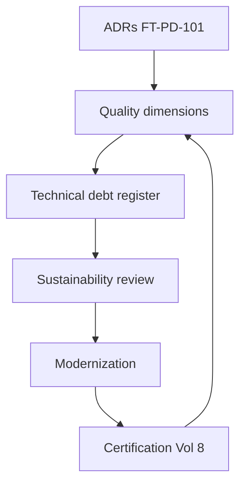
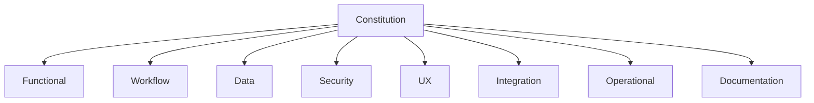
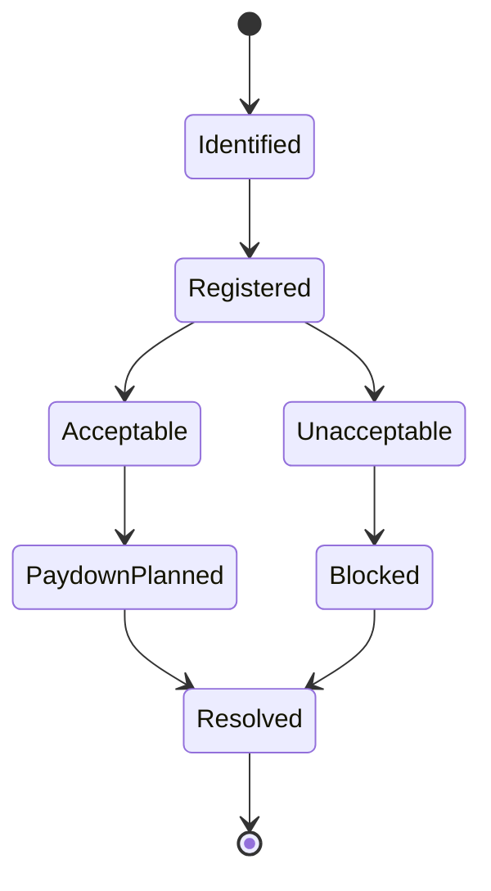
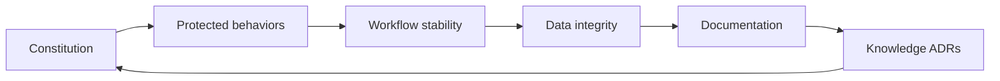
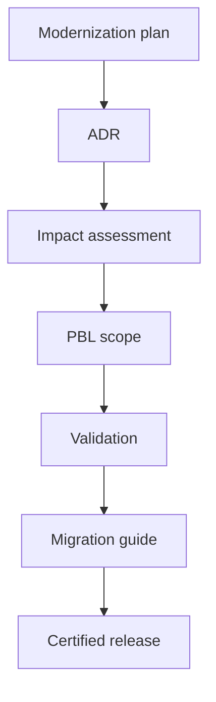
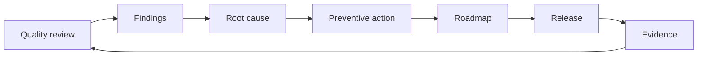
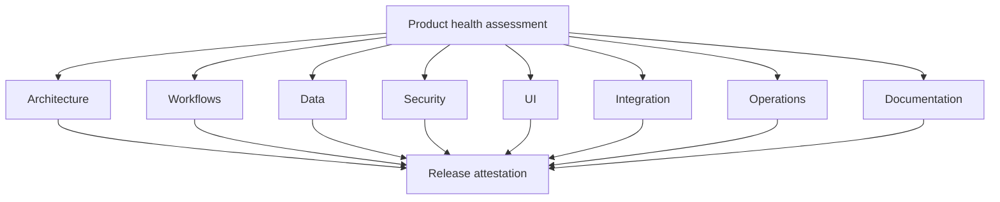

# Product Quality Strategy, Technical Debt & Architectural Sustainability

| Field | Value |
|-------|-------|
| **Document ID** | FT-PD-102 |
| **Volume** | 10 — Product Lifecycle & Continuous Evolution |
| **Chapter** | 3 — Product Quality Strategy, Technical Debt & Architectural Sustainability |
| **Title** | Product Quality Strategy, Technical Debt & Architectural Sustainability |
| **Version** | 1.0.0 |
| **Status** | Draft — Architecture Review |
| **Effective date** | 2026-05-29 |
| **Author** | FT ERP Product Team |
| **Owner** | FT ERP Product Architecture |
| **Audience** | Product owners, architecture board, domain leads, validation leads, operations governance, compliance officers |
| **Classification** | Product — Quality & Sustainability Architecture |

**Parent documents:**

- [Volume 1, Ch. 2 — FT ERP Constitution](../01_Product_Foundation/Chapter_02_FT_ERP_Constitution.md)
- [Volume 8 — Product Testing & Validation](../08_Product_Testing_and_Validation/README.md)
- [Volume 10, Ch. 1 — Product Lifecycle, Roadmap & Continuous Evolution](./Chapter_01_Product_Lifecycle_Roadmap_and_Continuous_Evolution.md)
- [Volume 10, Ch. 2 — Feature Governance, Change Control & ADRs](./Chapter_02_Feature_Governance_Change_Control_and_Architectural_Decision_Records.md)

---

## 1. Document Control

| Version | Date | Author | Summary |
|---------|------|--------|---------|
| 1.0.0 | 2026-05-29 | FT ERP Product Team | Initial Product Quality Strategy, Technical Debt & Architectural Sustainability |

**Supersedes:** None.

**Change authority:** Product Architecture Board. Quality policy changes require Constitution compliance review.

**Out of scope:** Coding standards, static analysis tools, programming languages, CI/CD pipelines, source code, development frameworks.

---

## 2. Purpose

This chapter defines **governance architecture** ensuring FT ERP remains **maintainable**, **sustainable**, **extensible**, and **architecturally consistent** throughout its lifecycle.

It specifies:

- **Product quality governance** and **technical debt governance**
- **Maintainability** and **modernization strategy**
- **Architectural sustainability** and **long-term quality improvement**
- **Quality stewardship**

The objective is to ensure future product evolution **improves quality** without compromising the **FT ERP Constitution**, **protected behaviors**, or **architectural consistency**.

---

## 3. Scope

### 3.1 In scope

- Quality philosophy (§5)
- Product quality model (§6)
- Technical debt governance (§7)
- Architectural sustainability (§8)
- Modernization strategy (§9)
- Quality improvement (§10)
- Business Rules QLT-01–QLT-12 (§11)
- Governance matrices (§12, §12A–G)
- Diagrams (§13)

### 3.2 Out of scope

- Documentation lifecycle and organizational learning detail — see [Volume 10 Ch. 4 (FT-PD-103)](./Chapter_04_Product_Knowledge_Management_Documentation_Governance_and_Organizational_Learning.md)
- Validation execution mechanics (Volume 8)
- Engineering implementation standards

### 3.3 Concept distinctions

| Concept | Definition |
|---------|------------|
| **Product quality** | Conformance to Constitution, architecture, and protected behaviors across all dimensions |
| **Technical debt** | Known gap between current state and architectural target — governed and visible |
| **Defects** | Unintended deviation from approved behavior — corrected via change control |
| **Product enhancement** | Intentional capability addition within architecture bounds |
| **Architectural modernization** | Controlled refresh preserving behavioral contracts |
| **Sustainability** | Long-term ability to evolve without eroding foundations |

---

## 4. Relationship with Previous Volumes

Architectural decisions ([FT-PD-101](./Chapter_02_Feature_Governance_Change_Control_and_Architectural_Decision_Records.md)) **directly influence** long-term product quality — accepted ADRs create consequences that become debt if unaddressed, or sustainability assets if stewarded.

| Volume | Quality relationship |
|--------|------------------------|
| **0–1** | Vision and Constitution — quality north star |
| **2–3** | Domain correctness — functional quality |
| **4** | Workflow quality — state and guard integrity |
| **5** | Data quality — immutability and ledger consistency |
| **6** | UX quality — surface triad coherence |
| **7** | Security quality — trust and governance |
| **8** | Validation evidence — measurable quality proof |
| **9** | Operational quality — deployability and resilience |
| **10 Ch. 1–2** | Evolution and change governance — quality gates |

---

## 5. Quality Philosophy

| Principle | Definition |
|-----------|------------|
| **Constitution-first quality** | Quality measured against Articles — not convenience ([QLT-01](#11-business-rules)) |
| **Architectural consistency** | Cross-volume alignment is a quality dimension |
| **Sustainable evolution** | Growth without eroding foundations |
| **Maintainability before complexity** | Simplicity preferred when outcomes are equivalent |
| **Evidence-driven quality** | Claims require validation evidence ([QLT-04](#11-business-rules)) |
| **Continuous quality improvement** | Each release may improve quality posture |
| **Long-term stewardship** | Quality owned beyond individual releases |

---

## 6. Product Quality Model

| Dimension | Definition | Governance |
|-----------|------------|------------|
| **Functional quality** | Domain behavior matches specifications | Domain leads; Vol. 3 scenarios |
| **Workflow quality** | States, Guards, handoffs correct and stable | Workflow lead; PBL catalog |
| **Data quality** | Integrity, immutability, snapshot rules upheld | Data architecture lead; Vol. 5 |
| **Security quality** | Authorization, audit, retention compliant | Security + Compliance; Vol. 7 |
| **User experience quality** | Dashboard, Workspace, Control Tower coherent | UX lead; Vol. 6 |
| **Integration quality** | Trust boundaries and handoffs reliable | Integration lead; Vol. 7 Ch. 5 |
| **Operational quality** | Deploy, monitor, recover, migrate effectively | Operations governance; Vol. 9 |
| **Documentation quality** | Product docs align with certified release | Documentation steward ([QLT-05](#11-business-rules)) |

---

## 7. Technical Debt Governance

### 7.1 Debt categories

| Category | Description | Example signal |
|----------|-------------|----------------|
| **Architectural debt** | Deviation from cross-volume design intent | Undocumented cross-domain coupling |
| **Workflow debt** | Guard or state semantics drift from Vol. 4 | Workaround transitions |
| **Documentation debt** | Product docs lag certified behavior | Missing ADR or volume update |
| **Configuration debt** | Policy sprawl or undocumented overrides | Tenant config without governance record |
| **Integration debt** | Trust boundary shortcuts | Undocumented external dependency |
| **Operational debt** | Runbook, capacity, or recovery gaps | Unsupported deployment pattern |

### 7.2 Acceptable vs unacceptable debt

| Classification | Criteria | Governance |
|----------------|----------|------------|
| **Acceptable debt** | Documented; time-bound; no PBL impact; ADR or debt register entry | Roadmap paydown scheduled |
| **Unacceptable debt** | Weakens protected behaviors; bypasses Constitution; undocumented | Block release until resolved ([QLT-02](#11-business-rules)) |

**Rule:** **Technical debt shall be visible and governed** — silent debt is unacceptable.

---

## 8. Architectural Sustainability

| Area | Sustainability objective | Governance |
|------|-------------------------|------------|
| **Cross-volume consistency** | Single truth across Product Documentation | Architecture board review |
| **Protected behavior preservation** | PBL catalog current and enforced | Validation lead |
| **Constitution alignment** | Every release attestation | Product Owner |
| **Workflow stability** | Semantic changes via ADR + Vol. 4 amendment | Workflow lead |
| **Data integrity** | Historical records remain interpretable | Data architecture lead |
| **Documentation evolution** | Docs version with release | Documentation steward |
| **Knowledge continuity** | ADRs and interpretations preserved ([FT-PD-101 §12F](./Chapter_02_Feature_Governance_Change_Control_and_Architectural_Decision_Records.md)) | Architecture board |

**Rule:** **Architectural sustainability is mandatory** — not optional post-release activity ([QLT-06](#11-business-rules)).

---

## 9. Modernization Strategy

| Element | Governance |
|---------|------------|
| **Platform evolution** | ADR required; impact assessment across Vol. 5–9 |
| **Technology refresh** | Technology-neutral planning; compatibility preservation |
| **Legacy replacement** | Migration path; parallel validation period |
| **Controlled refactoring** | PBL regression scope defined before authorization |
| **Compatibility preservation** | Closed history and cert evidence remain valid |
| **Modernization planning** | Roadmap slot; debt paydown linked ([EVO-03](./Chapter_01_Product_Lifecycle_Roadmap_and_Continuous_Evolution.md)) |

**Rule:** **Modernization shall preserve protected behaviors** unless formal PBL amendment approved ([QLT-03](#11-business-rules)).

Remain **technology-neutral** — modernization governs *what* must be preserved, not *how* implementation is performed.

---

## 10. Quality Improvement

| Element | Governance |
|---------|------------|
| **Quality reviews** | Scheduled product health assessments (§12F) |
| **Quality metrics** | Evidence-based indicators — not vanity counts |
| **Continuous improvement** | Preventive actions enter roadmap |
| **Root cause analysis** | Required for PBL regression and repeat defects |
| **Preventive actions** | Tracked to closure; linked to ADR or debt register |
| **Product health assessments** | Cross-dimensional review before major release |

Do **not** prescribe engineering tools — improvement is a **governance process** with evidence requirements.

---

## 11. Business Rules

| ID | Rule |
|----|------|
| **QLT-01** | **Product quality shall preserve the Constitution** — Art. 1–23. |
| **QLT-02** | **Technical debt shall be visible and governed** — undocumented debt is unacceptable. |
| **QLT-03** | **Modernization shall preserve protected behaviors** unless formal PBL amendment approved. |
| **QLT-04** | **Quality improvements require evidence** — validation or operational proof. |
| **QLT-05** | **Documentation quality evolves with the product** — aligned to certified releases ([EVO-10](./Chapter_01_Product_Lifecycle_Roadmap_and_Continuous_Evolution.md)). |
| **QLT-06** | **Architectural sustainability is mandatory** — reviewed per §12C schedule. |
| **QLT-07** | **Unacceptable debt blocks release authorization** until resolved or formally excepted per ADR-09. |
| **QLT-08** | **Workflow debt affecting PBL entries requires immediate remediation plan**. |
| **QLT-09** | **Quality reviews feed the roadmap** — not isolated reports. |
| **QLT-10** | **Root cause of protected behavior regression requires ADR or debt register update**. |
| **QLT-11** | **Modernization requires full impact assessment** per FT-PD-101 §8. |
| **QLT-12** | **Product health assessments occur before every major release** — attestation recorded. |

---

## 12. Governance Matrices

### 12A. Product Quality Matrix

| Quality Area | Governance | Review | Evidence |
|--------------|------------|--------|----------|
| **Functional** | Domain specifications | Per domain change | Domain acceptance scenarios |
| **Workflow** | Volume 4 + PBL | Per workflow change | PBL regression results |
| **Data** | Volume 5 rules | Per persistence change | Data integrity checks |
| **Security** | Volume 7 | Quarterly + per change | SEC/GOV audit sample |
| **UX** | Volume 6 triad | Per surface change | UXA acceptance |
| **Integration** | Volume 7 Ch. 5 | Per integration change | INT trust review |
| **Operational** | Volume 9 | Per major release | OPS checklist |
| **Documentation** | Product doc index | Per release | Doc version alignment |

### 12B. Technical Debt Matrix

| Debt Category | Business Impact | Resolution Strategy | Owner |
|---------------|-----------------|---------------------|-------|
| **Architectural** | Cross-volume drift | ADR + targeted modernization | Architecture board |
| **Workflow** | Incorrect transitions | Vol. 4 amendment + PBL update | Workflow lead |
| **Documentation** | Misinformed decisions | Doc sprint aligned to release | Documentation steward |
| **Configuration** | Policy inconsistency | Config governance review | Product Owner |
| **Integration** | Trust boundary risk | Integration ADR + validation | Integration lead |
| **Operational** | Support burden | Runbook + capacity update | Operations governance |

### 12C. Sustainability Matrix

| Architecture Area | Sustainability Objective | Review Frequency | Steward |
|-------------------|------------------------|------------------|---------|
| **Constitution** | Full compliance | Per major release | Product Architecture |
| **Workflow (Vol. 4)** | Semantic stability | Per workflow ADR | Workflow lead |
| **Data (Vol. 5)** | Historical interpretability | Per data ADR | Data architecture lead |
| **PBL catalog** | Complete and current | Per release | Validation lead |
| **Product documentation** | Version-aligned | Per release | Documentation steward |
| **ADR registry** | No orphaned decisions | Per new ADR | Architecture board |
| **Cross-volume refs** | Index consistency | Per release | Product Architecture |

### 12D. Modernization Matrix

| Modernization Area | Governance | Validation | Approval |
|--------------------|------------|------------|----------|
| **Platform evolution** | ADR + impact assessment | Full cert tier | Architecture board |
| **Technology refresh** | Modernization plan | Compatibility regression | Product Owner |
| **Legacy replacement** | Migration ADR | Parallel validation period | Product Owner + Ops |
| **Controlled refactoring** | Scoped change request | PBL subset | Architecture delegate |
| **Compatibility preservation** | Backward compat checklist | Historical scenario replay | Validation lead |
| **Deprecation-driven modernization** | EVO-04 migration guide | Customer comms | Product Owner |

### 12E. Quality Improvement Matrix

| Improvement Source | Assessment | Approval | Release Path |
|--------------------|------------|----------|--------------|
| **PBL regression finding** | Root cause analysis | Workflow lead | Patch cert |
| **Customer feedback** | Classify defect vs enhancement | Product triage | Per FT-PD-101 |
| **Quality review** | Health assessment §12F | Architecture board | Roadmap slot |
| **Debt paydown** | Debt register priority | Product Owner | Minor release |
| **Operational incident** | Ops review | Operations governance | Patch or minor |
| **Preventive action** | Risk assessment | Domain lead | Scheduled minor |

### 12F. Product Health Matrix

| Product Health Area | Review Objective | Evidence | Governance Owner |
|---------------------|------------------|----------|------------------|
| **Architecture** | Cross-volume consistency | ADR audit; sustainability §12C | Architecture board |
| **Workflows** | PBL coverage and stability | PBL catalog diff | Workflow lead |
| **Data** | Integrity and immutability | Vol. 5 compliance sample | Data architecture lead |
| **Security** | Auth, audit, retention | SEC/GOV review | Security lead |
| **UI** | Surface triad coherence | UXA scenario pass rate | UX lead |
| **Integration** | Trust boundary health | INT dependency map | Integration lead |
| **Operations** | Deploy and recover readiness | OPS + RES checklist | Operations governance |
| **Documentation** | Release alignment | Doc version vs cert bundle | Documentation steward |

### 12G. Quality Maturity Matrix

| Quality Maturity Level | Characteristics | Governance Focus | Expected Outcome |
|------------------------|-----------------|------------------|------------------|
| **Initial Product** | First releases; limited evidence history | Certification + PBL establishment | Baseline quality defined |
| **Managed Quality** | Debt register active; reviews scheduled | Debt visibility; domain ownership | Known quality posture |
| **Measured Quality** | Evidence-backed metrics per dimension | Health assessments §12F | Predictable release quality |
| **Optimized Quality** | Preventive actions dominate reactive fixes | Root cause closure; sustainability | Declining defect recurrence |
| **Continuous Excellence** | Quality improves each major release | Maturity-linked roadmap | Long-term platform trust |

This matrix describes how FT ERP **quality governance matures** over the product lifecycle ([§12F Product Maturity](./Chapter_01_Product_Lifecycle_Roadmap_and_Continuous_Evolution.md) in FT-PD-100).

---

## 13. Logical Diagrams

### 13.1 Product quality model

### 13.2 Technical debt lifecycle

### 13.3 Architectural sustainability

### 13.4 Modernization governance

### 13.5 Quality improvement cycle

### 13.6 Long-term product health

---

## 14. Review Checklist

- [ ] Quality governance completeness — §6, §12A
- [ ] Technical debt governance — §7, §12B, QLT-02, QLT-07
- [ ] Sustainability coverage — §8, §12C, QLT-06
- [ ] Modernization governance — §9, §12D, QLT-03, QLT-11
- [ ] Quality improvement — §10, §12E
- [ ] Product health — §12F, QLT-12
- [ ] Quality maturity — §12G
- [ ] Constitution alignment — QLT-01
- [ ] Protected behavior preservation — QLT-03, QLT-08
- [ ] Cross-volume consistency — §4, §12C
- [ ] Six Mermaid diagrams
- [ ] No coding/CI/tooling detail

---

## 15. Change Log

| Version | Date | Author | Summary |
|---------|------|--------|---------|
| 1.0.0 | 2026-05-29 | FT ERP Product Team | Initial Product Quality Strategy, Technical Debt & Architectural Sustainability |

---

## 16. Approval Block

| Role | Name | Signature | Date |
|------|------|-----------|------|
| Product Owner | | | |
| Product Architecture Board Chair | | | |
| Validation / QA Lead | | | |
| Operations Governance Lead | | | |
| Documentation Steward | | | |

---

## Writing Requirements

Remain **technology-neutral**.

**Do not include:** Coding standards, static analysis tools, programming languages, CI/CD pipelines, source code, development frameworks.

**Describe governance architecture only.**

---

## Document navigation

| | Link |
|--|------|
| **Previous** | [Feature Governance, Change Control & Architectural Decision Records](./Chapter_02_Feature_Governance_Change_Control_and_Architectural_Decision_Records.md) (FT-PD-101) |
| **Next** | [Product Knowledge Management, Documentation Governance & Organizational Learning](./Chapter_04_Product_Knowledge_Management_Documentation_Governance_and_Organizational_Learning.md) (FT-PD-103) |
| **Volume** | [Product Lifecycle and Continuous Evolution](./README.md) |
| **Product** | [Product Documentation Index](../README.md) |

