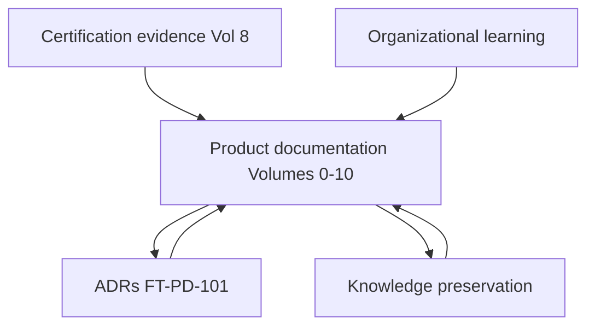
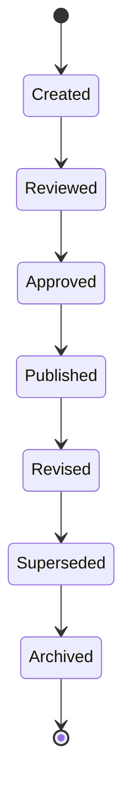
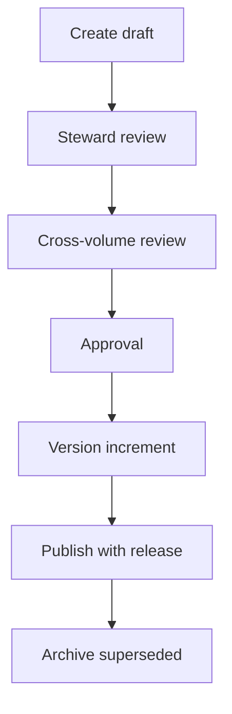
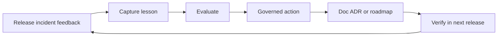
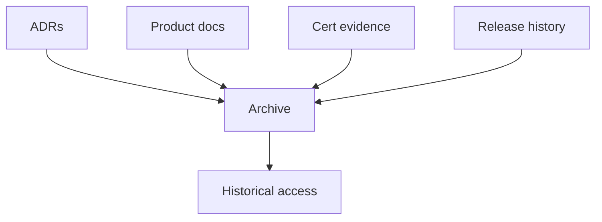
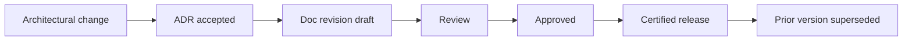
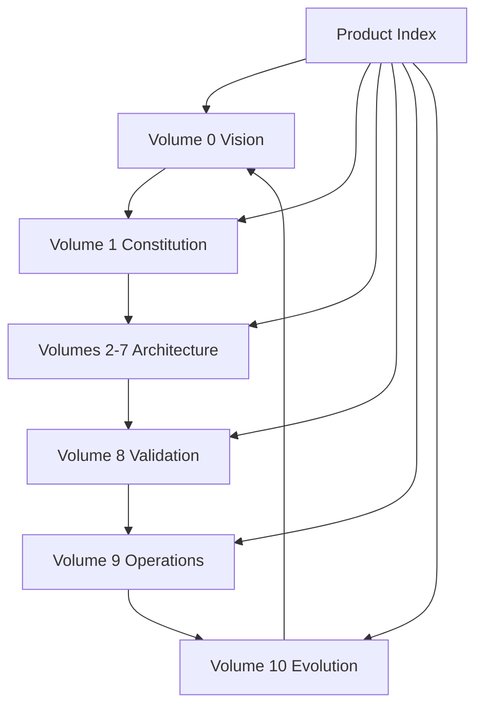

# Product Knowledge Management, Documentation Governance & Organizational Learning

| Field | Value |
|-------|-------|
| **Document ID** | FT-PD-103 |
| **Volume** | 10 — Product Lifecycle & Continuous Evolution |
| **Chapter** | 4 — Product Knowledge Management, Documentation Governance & Organizational Learning |
| **Title** | Product Knowledge Management, Documentation Governance & Organizational Learning |
| **Version** | 1.0.0 |
| **Status** | Draft — Architecture Review |
| **Effective date** | 2026-05-29 |
| **Author** | FT ERP Product Team |
| **Owner** | FT ERP Product Architecture |
| **Audience** | Product owners, documentation stewards, architecture board, domain leads, implementation partners, onboarding leads |
| **Classification** | Product — Knowledge & Documentation Governance Architecture |

**Parent documents:**

- [Product Documentation Index](../README.md)
- [Volume 1, Ch. 2 — FT ERP Constitution](../01_Product_Foundation/Chapter_02_FT_ERP_Constitution.md)
- [Volume 10, Ch. 2 — Feature Governance, Change Control & ADRs](./Chapter_02_Feature_Governance_Change_Control_and_Architectural_Decision_Records.md)
- [Volume 10, Ch. 3 — Product Quality Strategy](./Chapter_03_Product_Quality_Strategy_Technical_Debt_and_Architectural_Sustainability.md)

---

## 1. Document Control

| Version | Date | Author | Summary |
|---------|------|--------|---------|
| 1.0.0 | 2026-05-29 | FT ERP Product Team | Initial Product Knowledge Management, Documentation Governance & Organizational Learning |

**Supersedes:** None.

**Change authority:** Product Architecture Board + Documentation Steward. Knowledge policy changes require Constitution compliance review.

**Out of scope:** Wiki software, knowledge management tools, CMS products, documentation generators, source code, document authoring style guides.

---

## 2. Purpose

This chapter defines **governance architecture** ensuring FT ERP product knowledge remains **accurate**, **traceable**, **current**, and **transferable** throughout the product lifecycle.

It specifies:

- **Documentation governance** and **knowledge preservation**
- **Organizational learning** and **knowledge evolution**
- **Documentation lifecycle** and **cross-volume consistency**
- **Long-term stewardship**

The objective is to ensure product knowledge **survives personnel changes**, **organizational growth**, and **decades of product evolution**.

---

## 3. Scope

### 3.1 In scope

- Knowledge governance philosophy (§5)
- Product knowledge model (§6)
- Documentation governance (§7)
- Organizational learning (§8)
- Knowledge preservation (§9)
- Documentation lifecycle (§10)
- Business Rules KNW-01–KNW-12 (§11)
- Governance matrices (§12, §12A–G)
- Diagrams (§13)

### 3.2 Out of scope

- Long-term vision and future architecture stewardship — see [Volume 10 Ch. 5 (FT-PD-104)](./Chapter_05_Product_Stewardship_Long_Term_Vision_and_Future_Architecture.md)
- Customer-facing user manual authoring
- Engineering implementation documentation

### 3.3 Concept distinctions

| Concept | Definition |
|---------|------------|
| **Product documentation** | Authoritative architecture volumes under `docs/product/` — governed Core asset |
| **Customer documentation** | Tenant-specific deployment, config, and operational guides |
| **User manuals** | End-user task guidance — derived from product docs, not authoritative for architecture |
| **Training material** | Learning artifacts for roles — must align with approved product docs |
| **Knowledge assets** | ADRs, Constitution interpretations, decisions, rationale — permanent records |
| **Organizational learning** | Structured capture of lessons that improve product knowledge over time |

---

## 4. Relationship with Previous Volumes

Product documentation **supports every architecture area** while remaining a **governed product asset** — not an afterthought to implementation.

| Volume | Documentation role |
|--------|-------------------|
| **0** | Vision and strategy — roadmap north star |
| **1** | Constitution and principles — non-negotiable reference |
| **2–3** | Business and domain behavior |
| **4** | Workflow semantics authority |
| **5** | Data architecture authority |
| **6** | UI and experience architecture |
| **7** | Security, governance, integration |
| **8** | Validation and protected behaviors |
| **9** | Deployment and operations |
| **10 Ch. 1–3** | Evolution, change control, quality — govern how docs evolve |

**Rule:** Documentation is the **single source of truth** for product architecture ([KNW-01](#11-business-rules)). Customer and training materials **derive from** — never override — product documentation.

---

## 5. Knowledge Governance Philosophy

| Principle | Definition |
|-----------|------------|
| **Single source of truth** | Product docs + ADRs are authoritative for architecture |
| **Documentation before implementation** | Approved product doc change precedes or accompanies GA ([KNW-02](#11-business-rules)) |
| **Evidence-based knowledge** | Knowledge claims link to certification or ADR evidence |
| **Constitution alignment** | Every volume traceable to Articles |
| **Knowledge continuity** | Stewardship survives personnel change ([KNW-04](#11-business-rules)) |
| **Traceability** | Decisions link proposal → ADR → doc → release ([FT-PD-101 §10](./Chapter_02_Feature_Governance_Change_Control_and_Architectural_Decision_Records.md)) |
| **Continuous learning** | Lessons improve documentation — not isolated reports ([KNW-06](#11-business-rules)) |

---

## 6. Product Knowledge Model

| Knowledge category | Content scope | Steward |
|--------------------|---------------|---------|
| **Vision** | Why FT ERP exists; positioning | Product Owner |
| **Constitution** | Articles, interpretations | Product Architecture |
| **Business architecture** | Pipelines, ownership, document chains | Domain leads + Product Architecture |
| **Data architecture** | Persistence, snapshots, ledger | Data architecture lead |
| **Workflow architecture** | States, guards, orchestration | Workflow lead |
| **Security** | Authorization, audit, config, integration | Security + Compliance leads |
| **UI** | Surfaces, navigation, experience principles | UX lead |
| **Integration** | Trust boundaries, external systems | Integration lead |
| **Validation** | PBL, certification, evidence | Validation lead |
| **Operations** | Deploy, monitor, recover, lifecycle | Operations governance |
| **Product evolution** | Roadmap, ADRs, quality, knowledge — Volume 10 | Product Architecture Board |

Each steward ensures their category remains **current**, **cross-referenced**, and **aligned** with certified releases ([QLT-05](./Chapter_03_Product_Quality_Strategy_Technical_Debt_and_Architectural_Sustainability.md)).

---

## 7. Documentation Governance

| Activity | Governance |
|----------|------------|
| **Document creation** | Assigned Document ID; parent volume; change log initiated |
| **Review** | Domain steward + cross-volume reviewer when affected |
| **Approval** | Standard Approval Block; status → Approved |
| **Versioning** | Semantic product-doc version; increment on material change |
| **Cross-referencing** | Links to Constitution, ADRs, PBL, related chapters |
| **Retirement** | Superseded status — not silent deletion ([KNW-03](#11-business-rules)) |
| **Historical preservation** | Archived versions retained with effective dates |

**Statuses:** Draft → In Review → Approved → Superseded (see §10 lifecycle).

---

## 8. Organizational Learning

| Source | Governance |
|--------|------------|
| **Lessons learned** | Recorded after major release, incident, or pilot |
| **Product retrospectives** | Feed roadmap and documentation gaps |
| **Customer feedback** | Classified per FT-PD-100; doc updates when architecture affected |
| **Partner feedback** | Implementation patterns → knowledge base if reusable |
| **Training feedback** | Identifies doc clarity gaps — not architecture changes alone |
| **Knowledge transfer** | Onboarding uses approved reading order ([Product Index](../README.md)) |
| **Continuous learning** | Learning outputs update docs, ADRs, or debt register |

Learning **does not bypass** change control — architectural updates require ADR per ADR-01.

---

## 9. Knowledge Preservation

| Asset type | Preservation requirement |
|------------|-------------------------|
| **ADRs** | Permanent registry; superseded retained ([ADR-04](./Chapter_02_Feature_Governance_Change_Control_and_Architectural_Decision_Records.md)) |
| **Constitution interpretations** | Annotated guidance linked to Articles |
| **Product decisions** | Traceability chain §10 FT-PD-101 |
| **Workflow rationale** | Volume 4 + ADR cross-reference |
| **Deprecated features** | Migration guides; EVO-04 compliance |
| **Historical releases** | Release notes + cert bundle references |
| **Cross-version knowledge** | Superseded doc versions archived ([EVO-12](./Chapter_01_Product_Lifecycle_Roadmap_and_Continuous_Evolution.md)) |

**Rule:** **Knowledge preservation is mandatory** — not optional archival ([KNW-04](#11-business-rules)).

---

## 10. Documentation Lifecycle

| Stage | Definition |
|-------|------------|
| **Draft** | Work in progress; not authoritative for certification |
| **Review** | Steward review in progress |
| **Approved** | Authoritative for architecture governance |
| **Published** | Aligned to certified release; effective date set |
| **Revised** | New version in progress; prior version remains until superseded |
| **Superseded** | Replaced by newer version; retained for history |
| **Archived** | No longer active; read-only historical reference |

Implementation-neutral — no CMS, wiki, or generator prescribed.

---

## 11. Business Rules

| ID | Rule |
|----|------|
| **KNW-01** | **Documentation is a governed product asset** — not informal notes. |
| **KNW-02** | **Every architectural change updates documentation** before or with GA release. |
| **KNW-03** | **Historical documentation remains available** — superseded, never deleted silently. |
| **KNW-04** | **Knowledge preservation is mandatory** — ADRs, decisions, and archived docs retained. |
| **KNW-05** | **Cross-volume consistency shall be maintained** — index and cross-refs reviewed per release. |
| **KNW-06** | **Organizational learning continuously improves documentation** — lessons enter governed update path. |
| **KNW-07** | **Product documentation is the single source of truth** for product architecture. |
| **KNW-08** | **Customer and training materials shall not contradict** approved Product Documentation. |
| **KNW-09** | **Every product document requires an assigned steward** — no orphaned chapters. |
| **KNW-10** | **Approved documentation changes require version increment** and change log entry. |
| **KNW-11** | **Onboarding shall follow the published reading order** — Product Documentation Index. |
| **KNW-12** | **Knowledge transfer is required** when steward roles change — handoff recorded. |

---

## 12. Governance Matrices

### 12A. Knowledge Asset Matrix

| Knowledge Asset | Steward | Review | Retention |
|-----------------|---------|--------|-----------|
| **Constitution** | Product Architecture | Per major release | Permanent |
| **ADRs** | Architecture board | Per new ADR | Permanent; superseded retained |
| **PBL catalog** | Validation lead | Per release | Permanent; versioned |
| **Product volumes 0–10** | Volume steward | Per release | Permanent; superseded archived |
| **Certification bundles** | Validation lead | Per release | EVD retention (Vol. 8) |
| **Release records** | Product Owner | Per release | Permanent |
| **Lessons learned** | Product Architecture | Quarterly | Permanent |
| **Constitution interpretations** | Product Architecture | Per Article change | Permanent |

### 12B. Documentation Matrix

| Document Type | Governance | Approval | Lifecycle |
|---------------|------------|----------|-----------|
| **Volume chapter** | Document ID + version header | Product Owner + domain steward | Draft → Approved → Published |
| **ADR** | ADR identifier | Architecture board | Proposed → Accepted → Superseded |
| **PBL entry** | PBL identifier | Validation lead + Workflow lead | Draft → Active → Deprecated |
| **Release notes** | Release identifier | Product Owner | Published per release |
| **Migration guide** | Linked to deprecation ADR | Product Owner + Ops | Published until EOS |
| **Reading order / index** | Product doc index | Documentation steward | Revised per new chapter |

### 12C. Organizational Learning Matrix

| Learning Source | Evaluation | Action | Knowledge Update |
|-----------------|------------|--------|------------------|
| **Post-release retrospective** | Product Architecture | Roadmap + doc gap list | Chapter revision or ADR |
| **Customer feedback** | Product triage | Enhancement or doc clarify | FT-PD-100 path |
| **Partner implementation** | Reusable pattern check | ADR if architectural | Volume update |
| **Training feedback** | Clarity vs correctness | Doc clarify or training revise | Steward update |
| **Operational incident** | Root cause | Ops + product action | Ops vol + ADR if needed |
| **Pilot outcome** | GA or retire decision | Certification or sunset | Ch. 1 innovation path |
| **Quality review** | Health assessment | Debt or doc paydown | QLT-09 path |

### 12D. Knowledge Preservation Matrix

| Knowledge Type | Preservation | Review | Owner |
|----------------|--------------|--------|-------|
| **Accepted ADRs** | Decision registry | At supersession | Architecture board |
| **Superseded ADRs** | Archive linked to successor | At supersession | Architecture board |
| **Approved doc versions** | Version archive | At supersession | Documentation steward |
| **Deprecated features** | Migration + historical doc | Until EOS + grace | Product Owner |
| **Certification evidence** | EVD store | Per retention policy | Compliance |
| **Release history** | Release catalog | Per release | Product Owner |
| **Steward handoffs** | Handoff record | On role change | Outgoing + incoming steward |

### 12E. Documentation Lifecycle Matrix

| Lifecycle Stage | Entry Criteria | Exit Criteria | Steward |
|-----------------|----------------|---------------|---------|
| **Draft** | Author assigned | Review requested | Author |
| **Review** | Complete draft | Approval or revision | Domain steward |
| **Approved** | Sign-offs complete | Linked to certified release | Product Owner |
| **Published** | Release effective date | Revision initiated | Documentation steward |
| **Revised** | Material change identified | New version approved | Author + steward |
| **Superseded** | New version published | Archived | Documentation steward |
| **Archived** | No longer active | Permanent retention | Compliance delegate |

### 12F. Cross-Volume Governance Matrix

| Volume | Primary Steward | Cross-Reference Review | Update Trigger |
|--------|-----------------|------------------------|----------------|
| **0** | Product Owner | Vision → roadmap | Strategy change |
| **1** | Product Architecture | All volumes | Article amendment |
| **2** | Product Architecture | Domains, workflows | Pipeline change |
| **3** | Domain leads | Workflows, data | Domain behavior change |
| **4** | Workflow lead | Domains, validation | State/guard ADR |
| **5** | Data architecture lead | Domains, workflows | Persistence ADR |
| **6** | UX lead | Domains, workflows | Surface change |
| **7** | Security lead | Integration, validation | SEC/GOV change |
| **8** | Validation lead | PBL, all domains | Cert scope change |
| **9** | Operations governance | Deployment, data | Ops architecture change |
| **10** | Product Architecture Board | All volumes | Evolution policy change |

### 12G. Knowledge Maturity Matrix

| Knowledge Maturity Level | Characteristics | Governance Focus | Expected Outcome |
|----------------------------|-----------------|------------------|------------------|
| **Initial Knowledge** | Docs exist; inconsistent cross-refs | Establish stewards + index | Baseline structure |
| **Structured Knowledge** | Document IDs, reading order, stewards assigned | Lifecycle + approval | Navigable corpus |
| **Governed Knowledge** | ADRs, PBL, cert evidence linked | Traceability + preservation | Decisions reconstructable |
| **Institutional Knowledge** | Survives team turnover; onboarding path | Handoffs + learning loop | Reduced bus factor |
| **Continuous Learning Organization** | Lessons systematically improve docs | KNW-06 learning integration | Self-improving knowledge base |

---

## 13. Logical Diagrams

### 13.1 Knowledge lifecycle

### 13.2 Documentation governance

### 13.3 Organizational learning loop

### 13.4 Knowledge preservation

### 13.5 Documentation evolution

### 13.6 Cross-volume knowledge relationships

---

## 14. Review Checklist

- [ ] Documentation completeness — §7, §12B
- [ ] Knowledge preservation — §9, §12D, KNW-03, KNW-04
- [ ] Organizational learning — §8, §12C, KNW-06
- [ ] Cross-volume consistency — §12F, KNW-05
- [ ] Constitution alignment — KNW-01, §6
- [ ] Knowledge traceability — §5, link to FT-PD-101 §10
- [ ] Knowledge maturity — §12G
- [ ] Steward assignment — KNW-09, KNW-12
- [ ] Six Mermaid diagrams
- [ ] No wiki/CMS/tooling detail

---

## 15. Change Log

| Version | Date | Author | Summary |
|---------|------|--------|---------|
| 1.0.0 | 2026-05-29 | FT ERP Product Team | Initial Product Knowledge Management, Documentation Governance & Organizational Learning |

---

## 16. Approval Block

| Role | Name | Signature | Date |
|------|------|-----------|------|
| Product Owner | | | |
| Documentation Steward | | | |
| Product Architecture Board Chair | | | |
| Validation / QA Lead | | | |
| Compliance Officer | | | |

---

## Writing Requirements

Remain **technology-neutral**.

**Do not include:** Wiki software, knowledge management tools, CMS products, documentation generators, source code.

**Describe governance architecture only.**

---

*Corpus conclusion: Volume 10, Chapter 5 — [Product Stewardship, Long-Term Vision & Future Architecture](./Chapter_05_Product_Stewardship_Long_Term_Vision_and_Future_Architecture.md) (FT-PD-104).*
---

## Document navigation

| | Link |
|--|------|
| **Previous** | [Product Quality Strategy, Technical Debt & Architectural Sustainability](./Chapter_03_Product_Quality_Strategy_Technical_Debt_and_Architectural_Sustainability.md) (FT-PD-102) |
| **Next** | [Product Stewardship, Long-Term Vision & Future Architecture](./Chapter_05_Product_Stewardship_Long_Term_Vision_and_Future_Architecture.md) (FT-PD-104) |
| **Volume** | [Product Lifecycle and Continuous Evolution](./README.md) |
| **Product** | [Product Documentation Index](../README.md) |

