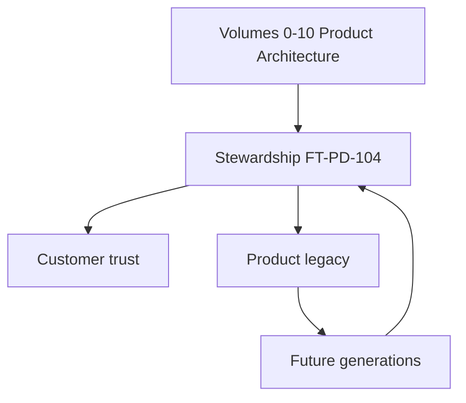
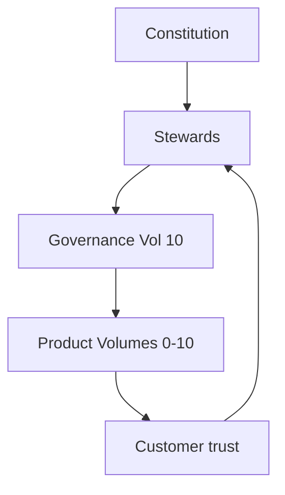
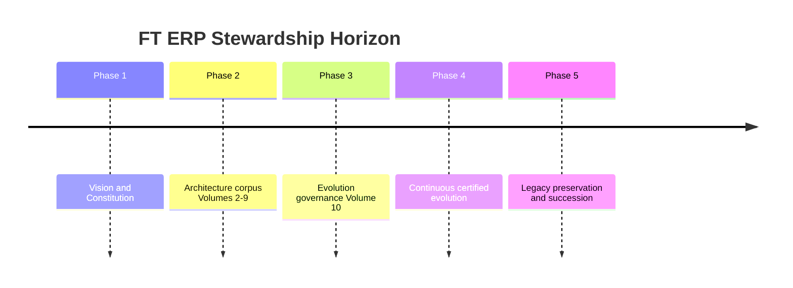
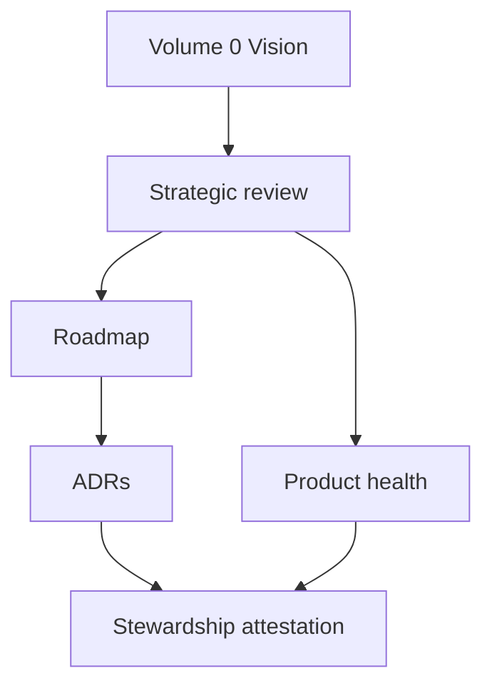
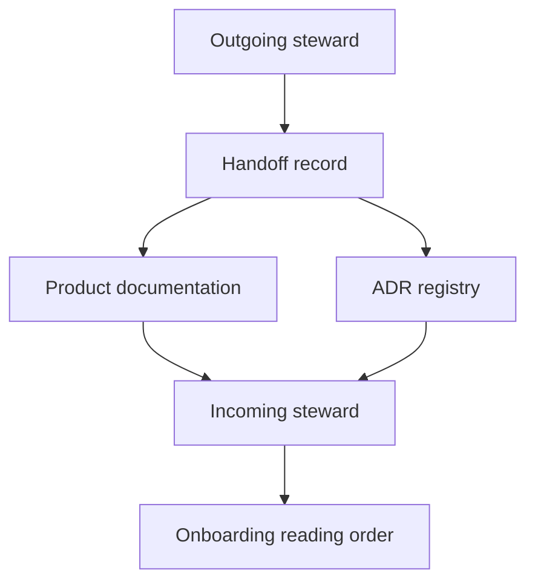
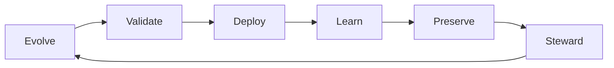

# Product Stewardship, Long-Term Vision & Future Architecture

| Field | Value |
|-------|-------|
| **Document ID** | FT-PD-104 |
| **Volume** | 10 — Product Lifecycle & Continuous Evolution |
| **Chapter** | 5 — Product Stewardship, Long-Term Vision & Future Architecture |
| **Title** | Product Stewardship, Long-Term Vision & Future Architecture |
| **Version** | 1.0.0 |
| **Status** | Draft — Architecture Review |
| **Effective date** | 2026-05-29 |
| **Author** | FT ERP Product Team |
| **Owner** | FT ERP Product Architecture |
| **Audience** | Product owners, architecture board, executive sponsors, domain stewards, implementation partners, customer executives |
| **Classification** | Product — Strategic Stewardship & Legacy Architecture |

**Parent documents:**

- [Product Documentation Index](../README.md)
- [Volume 0 — Product Vision & Strategy](../00_Product_Vision_and_Strategy/Volume_0_Product_Vision_and_Strategy.md)
- [Volume 1, Ch. 2 — FT ERP Constitution](../01_Product_Foundation/Chapter_02_FT_ERP_Constitution.md)
- [Volume 10, Ch. 1–4](./README.md)

---

## 1. Document Control

| Version | Date | Author | Summary |
|---------|------|--------|---------|
| 1.0.0 | 2026-05-29 | FT ERP Product Team | Initial Product Stewardship, Long-Term Vision & Future Architecture — concluding chapter of FT ERP Product Documentation |

**Supersedes:** None.

**Change authority:** Product Owner + Product Architecture Board. Stewardship policy changes require Constitution compliance review.

**Out of scope:** Technology predictions, vendor strategies, programming languages, cloud providers, AI implementation details, source code, future feature roadmaps.

---

## 2. Purpose

This chapter defines the **long-term stewardship model** for FT ERP — the enduring governance that ensures the product remains **trustworthy**, **adaptable**, and **architecturally coherent** throughout decades of evolution.

It specifies:

- **Product stewardship** and **long-term architectural vision**
- **Enduring product principles** and **strategic governance**
- **Future architecture guidance**, **architectural continuity**, and **product legacy**

The objective is to ensure FT ERP survives organizational change, market shifts, and continuous enhancement **without losing its identity or architectural integrity**.

This chapter **concludes** the FT ERP Product Documentation corpus (Volumes 0–10).

---

## 3. Scope

### 3.1 In scope

- Stewardship philosophy (§5)
- Long-term product vision (§6)
- Strategic governance (§7)
- Future architecture principles (§8)
- Organizational stewardship (§9)
- Product legacy (§10)
- Business Rules STW-01–STW-12 (§11)
- Stewardship matrices (§12, §12A–F)
- Diagrams (§13)

### 3.2 Out of scope

- Volume 11 Manufacturing Knowledge (optional domain reference — planned)
- Specific release plans or feature backlogs
- Implementation technology choices

### 3.3 Concept distinctions

| Concept | Definition |
|---------|------------|
| **Product vision** | Enduring purpose and positioning — Volume 0 |
| **Product roadmap** | Time-bound initiative commitment — FT-PD-100 |
| **Product stewardship** | Ongoing responsibility for architectural integrity across generations |
| **Product governance** | Rules and processes for change — Volumes 7, 8, 10 |
| **Product legacy** | Historical knowledge, decisions, and trust transferred to future stewards |

---

## 4. Relationship with Previous Volumes

Every architecture decision across Volumes 0–10 **contributes to long-term stewardship** — not merely immediate delivery.

| Volume | Stewardship contribution |
|--------|-------------------------|
| **0** | Vision continuity — why FT ERP endures |
| **1** | Constitution — highest enduring authority |
| **2–3** | Business and domain truth — manufacturing relevance |
| **4** | Workflow Engine — behavioral contract stability |
| **5** | Data architecture — historical interpretability |
| **6** | User experience — coherent surfaces across releases |
| **7** | Security and governance — trust boundaries |
| **8** | Validation — protected behaviors and evidence |
| **9** | Operations — deployability and resilience |
| **10 Ch. 1–4** | Evolution, ADRs, quality, knowledge — how stewardship operates |

**Closing principle:** Volumes 0–9 define **what FT ERP is**. Volume 10 defines **how it endures**. This chapter defines **who carries it forward and under what enduring principles**.

---

## 5. Stewardship Philosophy

| Principle | Definition |
|-----------|------------|
| **Constitution-first stewardship** | All stewards serve the Articles — not short-term convenience ([STW-01](#11-business-rules)) |
| **Customer value preservation** | Enhancements strengthen — never erode — customer trust ([STW-03](#11-business-rules)) |
| **Architectural integrity** | Cross-volume consistency maintained across decades |
| **Sustainable evolution** | Art. 23 continuous improvement within bounds |
| **Business trust** | Predictable behavior is a product asset |
| **Knowledge continuity** | ADRs, docs, and decisions survive personnel change ([KNW-04](./Chapter_04_Product_Knowledge_Management_Documentation_Governance_and_Organizational_Learning.md)) |
| **Responsible innovation** | Innovation strengthens foundations — does not replace them ([STW-04](#11-business-rules)) |

---

## 6. Long-Term Product Vision

FT ERP shall continue evolving as a **workflow-driven manufacturing ERP** while preserving:

| Pillar | Preservation commitment | Volume authority |
|--------|------------------------|------------------|
| **FT ERP Constitution** | Articles remain highest authority | Vol. 1 |
| **Protected Behaviors** | PBL catalog enforced; no silent regression | Vol. 8, FT-PD-081 |
| **Workflow Engine** | Semantic changes via formal amendment | Vol. 4 |
| **Business Architecture** | Pipeline and ownership models stable | Vol. 2 |
| **Data Architecture** | Immutability and ledger rules upheld | Vol. 5 |
| **Security** | Authorization, audit, retention | Vol. 7 |
| **User Experience** | Dashboard, Workspace, Control Tower triad | Vol. 6 |
| **Integration** | Trust boundaries explicit | Vol. 7 Ch. 5 |
| **Validation** | Certification before GA | Vol. 8 |
| **Operational Excellence** | Deploy, monitor, recover, lifecycle | Vol. 9 |

**Technology-neutral:** Vision describes **what must endure**, not **which technologies** future releases employ.

---

## 7. Strategic Governance

| Element | Governance |
|---------|------------|
| **Long-term architectural decisions** | ADR + architecture board; consequences documented |
| **Strategic reviews** | Periodic stewardship review — vision, debt, maturity |
| **Vision continuity** | Roadmap traceable to Volume 0 ([STW-02](#11-business-rules)) |
| **Market adaptation** | Informs roadmap — does not override Constitution |
| **Customer trust** | Protected behaviors and cert evidence as trust instruments |
| **Business sustainability** | Product identity preserved; no Core fork per customer |
| **Product identity** | Manufacturing-native, workflow-driven, constitution-governed |

---

## 8. Future Architecture Principles

Enduring principles for all future evolution — **no technology predictions**.

| Principle | Definition |
|-----------|------------|
| **Extensibility** | New domains and capabilities fit existing architecture patterns |
| **Modularity** | Boundaries respect domain, workflow, and trust separation |
| **Backward compatibility** | Closed history and cert evidence remain valid |
| **Architectural consistency** | Cross-volume alignment mandatory ([KNW-05](./Chapter_04_Product_Knowledge_Management_Documentation_Governance_and_Organizational_Learning.md)) |
| **Documentation discipline** | Product docs authoritative and version-aligned ([STW-05](#11-business-rules)) |
| **Product simplicity** | Prefer clarity over complexity when outcomes are equivalent |
| **Manufacturing relevance** | Domain decisions grounded in discrete manufacturing reality |

---

## 9. Organizational Stewardship

| Stakeholder | Responsibility | Authority | Accountability |
|-------------|----------------|-----------|----------------|
| **Product Owners** | Vision continuity; release authorization; customer trust | Roadmap approval; GA decision | Product identity and value |
| **Architects** | Cross-volume consistency; ADR stewardship | Architecture board; impact assessment | Architectural integrity |
| **Domain Experts** | Domain truth; business review | Domain sign-off | Functional correctness |
| **Implementation Partners** | Deploy and configure within architecture | Configuration layer only | No Core modification ([Art. 16](../01_Product_Foundation/Chapter_02_FT_ERP_Constitution.md)) |
| **Customers** | Feedback; operational reality | Configuration and Custom layers | Trust through predictable behavior |
| **Future Contributors** | Inherit stewardship responsibly ([STW-06](#11-business-rules)) | Governed change path only | Constitution and PBL compliance |

---

## 10. Product Legacy

| Element | Governance |
|---------|------------|
| **Historical preservation** | Superseded docs, ADRs, releases archived — never deleted silently |
| **Architectural continuity** | Each generation builds on prior ADRs and volumes |
| **Decision continuity** | Traceability chain FT-PD-101 §10 maintained |
| **Knowledge continuity** | Steward handoffs; onboarding reading order |
| **Long-term trust** | Cert evidence and PBL as permanent trust record |
| **Responsible succession** | Outgoing stewards document context for successors ([KNW-12](./Chapter_04_Product_Knowledge_Management_Documentation_Governance_and_Organizational_Learning.md)) |

---

## 11. Business Rules

| ID | Rule |
|----|------|
| **STW-01** | **The Constitution remains the highest architectural authority** — no steward may override Articles. |
| **STW-02** | **Product vision shall remain traceable** — roadmap and ADRs link to Volume 0. |
| **STW-03** | **Stewardship preserves customer trust** — protected behaviors and certification are non-negotiable. |
| **STW-04** | **Innovation shall strengthen, not replace, architectural foundations** — pilot ≠ governance bypass. |
| **STW-05** | **Documentation remains authoritative** — product docs govern architecture ([KNW-01](./Chapter_04_Product_Knowledge_Management_Documentation_Governance_and_Organizational_Learning.md)). |
| **STW-06** | **Future generations inherit the architecture responsibly** — onboarding and handoffs mandatory. |
| **STW-07** | **Strategic reviews occur at least once per major release cycle** — stewardship attestation recorded. |
| **STW-08** | **Long-term architectural decisions require ADR** with consequences for future stewards. |
| **STW-09** | **Product identity shall not be diluted** — FT ERP remains manufacturing-native and workflow-driven. |
| **STW-10** | **Legacy assets are permanent product records** — ADRs, PBL, cert evidence, release history. |
| **STW-11** | **Market adaptation shall not compromise Core Product protection** — Art. 16 enforced. |
| **STW-12** | **Volume 10 stewardship rules apply for the life of the product** — amended only via governed doc revision. |

---

## 12. Stewardship Matrices

### 12A. Stewardship Responsibility Matrix

| Responsibility | Primary Steward | Review | Evidence |
|----------------|-----------------|--------|----------|
| **Constitution compliance** | Product Architecture Board | Per major release | Article attestation |
| **Vision continuity** | Product Owner | Strategic review | Roadmap ↔ Vol. 0 map |
| **Protected behaviors** | Validation lead | Per release | PBL catalog |
| **Cross-volume consistency** | Product Architecture | Per release | Index + cross-ref audit |
| **Knowledge preservation** | Documentation steward | Per release | Archive completeness |
| **Customer trust** | Product Owner | Post-major-release | Cert bundle + feedback |
| **Succession readiness** | Outgoing steward | On role change | Handoff record |

### 12B. Strategic Governance Matrix

| Governance Area | Review Frequency | Owner | Outcome |
|-----------------|------------------|-------|---------|
| **Vision alignment** | Annual + major release | Product Owner | Roadmap validated |
| **Architecture health** | Per major release | Architecture board | Sustainability report |
| **Technical debt posture** | Per major release | Product Owner | Paydown plan |
| **Knowledge maturity** | Annual | Documentation steward | Maturity assessment §12G KNW |
| **Customer trust indicators** | Per major release | Product Owner | Trust attestation |
| **Stewardship succession** | On role change | Product Architecture | Handoff complete |
| **Product identity** | Annual | Product Owner | Identity statement current |

### 12C. Future Architecture Matrix

| Architecture Area | Enduring Principle | Evolution Constraint | Steward |
|-------------------|-------------------|----------------------|---------|
| **Constitution** | Highest authority | Amendment process only | Product Architecture |
| **Workflow** | Semantic stability | Vol. 4 + ADR | Workflow lead |
| **Data** | Historical integrity | Immutability rules | Data architecture lead |
| **Security** | Trust boundaries | SEC/GOV compliance | Security lead |
| **UI** | Surface triad | UXA principles | UX lead |
| **Integration** | Explicit trust | INT boundaries | Integration lead |
| **Validation** | Evidence-based release | Vol. 8 gates | Validation lead |
| **Operations** | Resilience | Vol. 9 standards | Operations governance |

### 12D. Organizational Stewardship Matrix

| Stakeholder | Responsibility | Authority | Accountability |
|-------------|----------------|-----------|----------------|
| **Product Owner** | Vision, roadmap, GA | Final feature approval | Customer trust |
| **Architecture board** | ADRs, exceptions, sustainability | Implementation authorization | Integrity |
| **Domain leads** | Domain truth | Business sign-off | Correctness |
| **Validation lead** | Conformance proof | Certification scope | PBL enforcement |
| **Documentation steward** | Doc corpus | Publish alignment | KNW compliance |
| **Implementation partner** | Tenant delivery | Config/Custom only | Art. 16 |
| **Customer** | Operational feedback | Config policies | Adoption success |
| **Future contributor** | Governed enhancement | Change control path | STW-06 |

### 12E. Product Legacy Matrix

| Legacy Asset | Preservation Method | Review | Successor Responsibility |
|--------------|---------------------|--------|--------------------------|
| **Constitution** | Versioned; amendment log | Per amendment | Uphold Articles |
| **ADRs** | Permanent registry | At supersession | Read before deciding |
| **PBL catalog** | Versioned | Per release | No regression |
| **Product volumes 0–10** | Archived superseded versions | Per release | Maintain cross-refs |
| **Certification evidence** | EVD retention | Per policy | Historical validity |
| **Release history** | Release catalog | Per release | Migration context |
| **Lessons learned** | Knowledge base | Quarterly | Feed governed updates |

### 12F. Architecture Legacy Matrix

| Architecture Asset | Why It Must Endure | Steward | Preservation Strategy |
|--------------------|-------------------|---------|----------------------|
| **Product Vision** | North star across decades | Product Owner | Vol. 0; strategic review |
| **Constitution** | Non-negotiable product law | Product Architecture | Vol. 1; amendment only |
| **Protected Behaviors** | Customer trust contract | Validation lead | PBL; regression enforcement |
| **Workflow Engine** | Behavioral consistency | Workflow lead | Vol. 4; ADR for changes |
| **Product Documentation** | Single source of truth | Documentation steward | KNW governance |
| **Architectural Decisions** | Rationale for future stewards | Architecture board | ADR registry |
| **Product Knowledge** | Organizational memory | Product Architecture Board | Vol. 10 Ch. 4 |

---

## 13. Logical Diagrams

### 13.1 Long-term stewardship model

### 13.2 Product evolution across decades

### 13.3 Strategic governance

### 13.4 Architecture continuity

### 13.5 Knowledge inheritance

### 13.6 Continuous stewardship

---

## 14. Review Checklist

- [ ] Constitution alignment — STW-01
- [ ] Vision continuity — STW-02, §6
- [ ] Stewardship completeness — §9, §12A, §12D
- [ ] Long-term sustainability — §8, §12C
- [ ] Legacy preservation — §10, §12E, §12F, STW-10
- [ ] Cross-volume consistency — §4, §12C
- [ ] Innovation within foundations — STW-04
- [ ] Six Mermaid diagrams
- [ ] No technology predictions or vendor detail

---

## 15. Change Log

| Version | Date | Author | Summary |
|---------|------|--------|---------|
| 1.0.0 | 2026-05-29 | FT ERP Product Team | Initial Product Stewardship, Long-Term Vision & Future Architecture — concluding FT ERP Product Documentation |

---

## 16. Approval Block

| Role | Name | Signature | Date |
|------|------|-----------|------|
| Product Owner | | | |
| Product Architecture Board Chair | | | |
| Executive Sponsor | | | |
| Validation / QA Lead | | | |
| Documentation Steward | | | |
| Customer Advisory Representative | | | |

---

## Writing Requirements

Remain **technology-neutral**.

**Do not include:** Technology predictions, vendor strategies, programming languages, cloud providers, AI implementation details, source code.

**Describe enduring governance principles only.**

---

## Corpus conclusion

This chapter completes **FT ERP Product Documentation** (Volumes 0–10). The corpus defines a **self-sustaining architecture** — vision and constitution at the foundation, domain and technical architecture in the middle, validation and operations as proof and placement, and evolution governance as the enduring stewardship layer.

**Optional extension:** Volume 11 — Manufacturing Knowledge Reference (domain depth for BOM, RM, and shop-floor patterns).

*The architecture is defined. Stewardship ensures it endures.*
---

## Document navigation

| | Link |
|--|------|
| **Previous** | [Product Knowledge Management, Documentation Governance & Organizational Learning](./Chapter_04_Product_Knowledge_Management_Documentation_Governance_and_Organizational_Learning.md) (FT-PD-103) |
| **Next** | — |
| **Volume** | [Product Lifecycle and Continuous Evolution](./README.md) |
| **Product** | [Product Documentation Index](../README.md) |

